</img>
---
# Autorzy:
Artur Michalski, Ignacy Sujecki, Mateusz Tabor, Dawid Maksymowski, Damian Wyszołmirski

<br>
<br>


# System rezerwacji pokoi hotelowych

<br>


Table of Contents

   * [Podział na moduły](#podział-na-moduły)
      * [Aplikacja Kliencka](#aplikacja-kliencka)
      * [Moduł Hotelowy](#moduł-hotelowy)
      * [Moduł Serwerowy](#moduł-serwerowy)
   * [Diagramy PU i User stories](#diagramy-pu-i-user-stories)
      * [User stories](#user-stories)
      * [Diagramy PU](#diagramy-pu)
         * [Aplikacja kliencka](#aplikacja-kliencka-1)
         * [Hotel](#hotel)
         * [Serwer](#serwer)
      * [Przykładowe przypadki użycia (use cases)](#przykładowe-przypadki-użycia-use-cases)
         * [Wyszukanie pokoju przez klienta](#wyszukanie-pokoju-przez-klienta)
         * [Dodanie nowej oferty pokoju do systemu przez managera hotelu](#dodanie-nowej-oferty-pokoju-do-systemu-przez-managera-hotelu)
         * [Rezerwacja pokoju przez klienta](#rezerwacja-pokoju-przez-klienta)
   * [Diagramy Klas](#diagramy-klas)
      * [Aplikacja Kliencka](#aplikacja-kliencka-2)
         * [ClientManager](#clientmanager)
         * [HotelInfo](#hotelinfo)
         * [HotelSearchOptions](#hotelsearchoptions)
         * [Offer](#offer)
         * [OfferSearchOptions](#offersearchoptions)
         * [ReservationInfo](#reservationinfo)
         * [ClientReservaton](#clientreservaton)
         * [ReviewInfo](#reviewinfo)
         * [ClientReview](#clientreview)
      * [Moduł hotelowy](#moduł-hotelowy-1)
         * [OfferInfo](#offerinfo)
         * [Offer](#offer-1)
         * [Room](#room)
         * [Client](#client)
         * [Reservation](#reservation)
         * [ReservationInfo](#reservationinfo-1)
         * [DataManager](#datamanager)
         * [HotelInfo](#hotelinfo-1)
         * [ServerConnectionIncoming](#serverconnectionincoming)
         * [ServerConnectionOutgoing](#serverconnectionoutgoing)
         * [HotelManager](#hotelmanager)
      * [Moduł Serwerowy](#moduł-serwerowy-1)
         * [Client](#client-1)
         * [ClientConnection](#clientconnection)
         * [DataManager](#datamanager-1)
         * [HotelInfo](#hotelinfo-2)
         * [HotelSearchOptions](#hotelsearchoptions-1)
         * [OfferSearchOptions](#offersearchoptions-1)
         * [ReservationInfo](#reservationinfo-2)
         * [ClientReservation](#clientreservation)
         * [OfferInfo](#offerinfo-1)
         * [Offer](#offer-2)
         * [ReviewInfo](#reviewinfo-1)
         * [ClientReview](#clientreview-1)
         * [HotelConnectionIncoming](#hotelconnectionincoming)
         * [HotelConnectionOutgoing](#hotelconnectionoutgoing)
		 * [ReservationService](#reservationservice)
		 * [ReviewService](#reviewservice)
		 * [OfferService](#offerservice)
		 * [ClientService](#clientservice)
		 * [HotelService](#hotelservice)
   * [Diagramy stanu](#diagramy-stanu)
      * [Pokój hotelowy](#pokój-hotelowy)
      * [Oferta pokoju](#oferta-pokoju)
      * [Rezerwacja pokoju](#rezerwacja-pokoju)
   * [Diagramy aktywności i sekwencji](#diagramy-aktywności-i-sekwencji)
      * [Oferta](#oferta)
         * [Dodawanie oferty](#dodawanie-oferty)
         * [Usuwanie oferty](#usuwanie-oferty)
         * [Edytowanie oferty](#edytowanie-oferty)
         * [Wyszukiwanie oferty](#wyszukiwanie-oferty)
      * [Rezerwacja](#rezerwacja)
         * [Tworzenie rezerwacji](#tworzenie-rezerwacji)
         * [Anulowanie rezerwacji](#anulowanie-rezerwacji)
         * [Tworzenie rezerwacji lokalnie](#tworzenie-rezerwacji-lokalnie)
      * [Opinia](#opinia)
         * [Dodawanie opinii](#dodawanie-opinii)
      * [Synchronizacja](#synchronizacja)
   * [Hotel-Serwer](#hotel-serwer)
      * [Logowanie i uwierzytelnienie hotelu](#logowanie-i-uwierzytelnienie-hotelu)
         * [HOTEL_LOGIN_REQUEST](#hotel_login_request)
         * [HOTEL_LOGIN_RESPONSE_FAILURE](#hotel_login_response_failure)
      * [Synchronizacja](#synchronizacja-1)
         * [HOTEL_SYNC_REQUEST](#hotel_sync_request)
         * [SERVER_SYNC_REQUEST](#server_sync_request)
      * [Zarządzanie ofertami](#zarządzanie-ofertami)
         * [OFFER_ADD_REQUEST](#offer_add_request)
         * [OFFER_ADD_SUCCESS](#offer_add_success)
         * [OFFER_ADD_FAILURE](#offer_add_failure)
         * [OFFER_DELETE_REQUEST](#offer_delete_request)
         * [OFFER_DELETE_SUCCESS](#offer_delete_success)
         * [OFFER_DELETE_FAILURE](#offer_delete_failure)
         * [OFFER_EDIT_REQUEST](#offer_edit_request)
         * [OFFER_EDIT_SUCCESS](#offer_edit_success)
         * [OFFER_EDIT_FAILURE](#offer_edit_failure)
      * [Zarządzanie rezerwacjami](#zarządzanie-rezerwacjami)
         * [RESERVATION_CREATE](#reservation_create)
         * [RESERVATION_DELETE](#reservation_delete)
         * [RESERVATION_GET](#reservation_get)
   * [Klient-Serwer](#klient-serwer)
      * [Autentykacja i autoryzacja](#autentykacja-i-autoryzacja)
      * [Logowanie klienta i pobieranie danych o kliencie](#logowanie-klienta-i-pobieranie-danych-o-kliencie)
         * [/Client](#client-2)
         * [/Client/login](#clientlogin)
      * [Wyszukiwanie hoteli](#wyszukiwanie-hoteli)
         * [/Hotel](#hotel-1)
         * [/Hotel/{HotelID}](#hotelhotelid)
      * [Wyszukiwanie ofert](#wyszukiwanie-ofert)
         * [/Hotel/{HotelID}/Offer](#hotelhotelidoffer)
         * [/Hotel/{HotelID}/Offer/{OfferID}](#hotelhotelidofferofferid)
      * [Zarządzanie rezerwacjami](#zarządzanie-rezerwacjami-1)
         * [/Reservations](#reservations)
         * [/Reservations/{HotelID}/{ReservationID}](#reservationshotelidreservationid)
      * [Zarządzanie opiniami](#zarządzanie-opiniami)
         * [/Review](#review)
         * [/Review/{id}](#reviewid)
   * [Scenariusze testowe](#scenariusze-testowe)
      * [Dodawanie nowej oferty](#dodawanie-nowej-oferty)
      * [Edycja istniejącej oferty](#edycja-istniejącej-oferty)
      * [Usuwanie istniejącej oferty](#usuwanie-istniejącej-oferty)
      * [Wyszukiwanie ofert](#wyszukiwanie-ofert-1)
      * [Synchronizacja / dodawanie lokalnej Rezerwacji](#synchronizacja--dodawanie-lokalnej-rezerwacji)
      * [Dodawanie Opinii](#dodawanie-opinii-1)
      * [Usuwanie Opinii](#usuwanie-opinii)
      * [Edycja Opinii](#edycja-opinii)
      * [Rezerwacja pokoju przez klienta](#rezerwacja-pokoju-przez-klienta-1)
      * [Anulowanie Rezerwacji](#anulowanie-rezerwacji-1)
   * [Wymagania Technologiczne](#wymagania-technologiczne)
      * [Serwer](#serwer-1)
      * [Aplikacja Kliencka](#aplikacja-kliencka-3)
      * [System hotelowy](#system-hotelowy)

# Wprowadzenie
Celem projektu jest stworzenie systemu do rezerwacji pokoi w hotelach.
Aplikacja pozwala obsłudze hotelu na udostępnienie oferty w systemie, a
użytkownikowi na zarezerwowanie pokoju z oferty w określonym oknie
czasowym. Obsługa hotelu dzieli się na pracowników z różnym poziomem
dostępu do zasobów aplikacji. Manager hotelu pełni rolę administratora
modułu hotelowego. Serwer aplikacji przetrzymuje kopie wszystkich ofert,
więc po złożeniu rezerwacji i sprawdzeniu kieruje prośbę do systemu
hotelowego, gdzie hotel jeszcze raz potwierdza dostępność.

## Glosariusz

Poniżej znajdują się definicje kluczowych elementów naszego systemu.
Warto wśród nich zwrócić uwagę na rozróżnienie Pokoju oraz Oferty.
Podział taki został zastosowany, aby nie powielać tych samych informacji
wśród różnych pokoi, będących w istocie takimi samymi z punktu widzenia
Klienta.

-   **Pokój**\
    Reprezentuje fizyczny pokój obecny w hotelu, w którym się znajduje.
    Jest konkretnym reprezentantem Oferty (patrz: następny punkt). Dane
    dotyczące pokoi są przechowywane w bazie danych Hotelu.
    Najwygodniej, gdy jego ID jest tożsame z fizycznym numerem pokoju,
    jednak -- jako, że informacje o tych obiektach są przechowywane w
    lokalnej bazie hotelu -- identyfikacja leży całkowicie w gestii
    zarządcy tej bazy.

-   **Oferta**\
    Reprezentuje pokoje o takich samych parametrach, które są
    nierozróżnialne z punktu widzenia Klienta rezerwującego pokój.
    Oferta ma określoną liczbę gości (dorosłych oraz dzieci), posiada
    opis i (opcjonalnie) zdjęcia. Ponieważ oferta jest tworzona lokalnie
    w module hotelowym, jest rozróżnialna przez ID hotelu, w którym się
    znajduje oraz jej lokalne ID.

-   **Rezerwacja**\
    Reprezentuje wynajem pokoju przez klienta w określonym odcinku
    czasowym. Klient dokonuje rezerwacji pokoju poprzez wybranie Oferty.
    To, który Pokój zostanie przypisany do Rezerwacji jest decyzją
    hotelu. ID rezerwacji jest przypisywane przez hotel i unikatowe w
    obrębie modułu hotelowego.

-   **Opinia**\
    Po pobycie w danym hotelu w ciągu 30 dni klient ma możliwość
    wystawienia opinii, czyli krótkiego opisu swoich przeżyć w hotelu
    wraz z oceną w skali od 1 do 10. Opinia jest przetrzymywana przez
    serwer i dołączana do wysyłanych ofert hotelu którego dotyczy. ID
    opinii jest przypisywane przez serwer więc jest unikalne w całym
    systemie.

-   **Klient**\
    Użytkownik Aplikacji klienckiej, który może w systemie się
    zarejestrować oraz zalogować. Tylko za pośrednictwem konta
    Klienckiego możliwe jest przeglądanie Ofert, Hoteli oraz złożenie
    rezerwacji. ID klienta jest przypisywane przez serwer więc jest
    unikalne w całym systemie.

-   **Hotel**\
    Reprezentuje fizyczną jednostkę hotelu rzeczywistego świata.
    Dodawanie Ofert i reklamowanie się do potencjalnych klientów za
    pośrednictwem Systemu jest możliwe wyłącznie za pośrednictwem
    takiego konta.

-   **Pracownik**\
    Reprezentuje fizyczną osobę pracującą w hotelu. Posiada uprawnienia
    i w zależności od nich może edytować i pobierać dane z systemu
    hotelowego, które mogą usprawniać jego pracę.

# Podział na moduły

System składa się z 3 modułów niezależnych od siebie. Mogą one (choć nie
muszą) być uruchomione i działać na oddzielnych maszynach. Moduły te to:

-   Aplikacja Kliencka

-   System Hotelowy

-   Moduł Serwerowy

## Aplikacja Kliencka

Ten moduł wyposażony jest w interfejs graficzny pozwalający na
wyświetlanie ofert wraz ze zdjęciami i list dostępnych ofert do wyboru
oraz w wyszukiwarkę. Pozwala również klientowi zarezerwować pokój(przez
wybór oferty i kliknięcie \"rezerwuj\"), anulować rezerwacje, a także
zostawiać opinię dotyczącą odbytego pobytu. Moduł ten porozumiewa się
tylko z modułem serwerowym. W systemie jest dowolna liczba instancji
modułów Aplikacji Klienckiej.

## Moduł Hotelowy

Moduł zwiera interfejs graficzny pozwalający na wyświetlanie informacji
oraz modyfikowanie i dostęp do danych hotelowych związanych z dostępnymi
ofertami jak i rezerwacjami, pokojami hotelowymi czy użytkownikami
systemu hotelowego (obsługa hotelowa). Moduł hotelowy zawiera system
uprawnień użytkowników jak i konto administracyjne służące do
zarządzania systemem hotelowym. Moduł ten komunikuje się tylko z
serwerem. W systemie może być dowolna liczba instancji modułów
hotelowych.

## Moduł Serwerowy

System ten posiada interfejs konsolowy. Pośredniczy on w komunikacji
pomiędzy hotelami i klientami, oraz przechowuje dane o ofertach
udostępnianych użytkownikom oraz o ocenach jakie użytkownicy wystawili
poszczególnym hotelom. Serwer powinien mieć tyle informacji, aby bez
komunikacji z poszczególnymi hotelami móc przedstawić klientowi oferty
spełniające jego zapytanie. Wymagana jest zatem synchronizacja
dostępności ofert serwera z systemami hotelowymi wystawiającymi te
oferty w celu stwierdzenia dostępności oferty w imieniu danego hotelu. W
systemie jest tylko jeden moduł serwerowy.\

# Diagramy PU i User stories

## User stories

| ja jako... | chcę... | po to, żeby... | Flaga |
| --- | --- | --- | --- |
| klient | zarezerwować pokój |  nie martwić się jego brakiem | MH |
| klient | wyszukiwać pokoje po kryteriach | znaleźć pokój, który spełnia moje oczekiwania | MH |
| klient | wyszukiwać hotele po kryteriach | znaleźć hotel, który spełnia moje oczekiwania | MH |
| klient | móc anulować rezerwację | | SH |
| klient | móc zostawić opinię z oceną | wyrazić swoją opinię na temat oferty | SH |
| klient | mieć kontakt z hotelem | móc dopytać o szczegóły oferty | CH |
| manager hotelu | umieszczać nowe oferty |  | MH |
| manager hotelu | edytować oferty | zmieniać wolne terminy i pokazać klientowi moją aktualną ofertę | MH |
| manager hotelu | zdejmować oferty |  | MH |
| manager hotelu | wprowadzać promocje do swoich ofert | zachęcić klientów do pobytu | CH |
| manager hotelu | móc zdjąć rezerwację z oferty | anulować rezerwację | CH |
| manager hotelu | dodawać zdjęcia | uatrakcyjnić ofertę | CH |
| manager hotelu | mieć kontakt z klientem | poinformować go o statusie rezerwacji | CH |
| manager hotelu | zakładać konta pracownikom | zautomatyzować przepływ informacji | CH |
| manager hotelu | grupować pokoje | ułatwić przypisywanie pracownikom zadań | CH |
| system hotelowy | mieć możliwość wymiany informacji z serwerem | przetworzyć zapytania klientów i dostarczać serwerowi informacji o hotelu | MH |
| system hotelowy | mieć możliwość edycji kalendarzadostępności pokoi w hotelu | - | MH |
| system hotelowy | móc rezerwować pokoje | - | SH |
| system hotelowy | anulować rezerwację pokoju | - | CH |
| system hotelowy | mieć możliwość kontaktu z klientem | poinformować o ewentualnych zmianach | CH |
| obsługa hotelowa | móc rezerwować pokoje | klienci mogli rezerwować pokoje na miejscu u recepcjonisty | CH |
| obsługa hotelowa | anulować rezerwację pokoju na życzenie klienta | - | CH |
| obsługa hotelowa | wiedzieć kiedy zwalnia się pokój | móc go posprzątać | CH |
| obsługa hotelowa | mieć przejrzyste podsumowanie zwalniających się pokoi | móc sobie łatwo zorganizować pracę | CH |
| obsługa hotelowa | wiedzieć ile osób wykupiło wyżywienie | wiedzieć ile przygotować porcji | CH |
| obsługa hotelowa | wiedzieć ile jest dzieci, dorosłych | animator mógł lepiej dostosowywać treść pokazów, zajęć | WH |
| serwer | wysyłać zapytania o wolne pokoje | odpowiadać na zapytania klienta | MH |
| serwer | znać lokalizacje hoteli | pokazywać oferty z miejsc wybranych przez klienta} | MH |
| serwer | znać opinie hoteli | pokazywać oferty o minimalnym  standardzie wybranym przez klienta | MH |
| serwer | znać średnie ceny hoteli | pokazywać oferty z zakresu cenowego  wybranego przez klienta | MH |
| serwer | znać rodzaj dostępnych pokoi hotelu | pokazywać hotele mające w ofercie konkretne pokoje | MH |
| serwer | znać udogodnienia hoteli | pokazywać oferty z z udogodnieniami  wybranymi przez klienta | MH |

Powyższa tabela przedstawia przewidywane przez nasz zespół historie
użytkowników naszego systemu. Na jej podstawie można w relatywnie prosty
sposób określić granice działania systemu jak i jego funkcjonalności.
Szczególnie użyteczne w tym celu są określone dla każdego user stories
flagi oznaczające priorytety wyróżnionych przez nas funkcjonalności.
Zastosowany model MoSCoW w sposób przejrzysty prezentuje, które user
stories uważamy za krytyczne dla prawidłowego funkcjonowania systemu
(**M**ust **H**ave/**S**hould **H**ave), a których implementację
rozważamy (**C**ould **H**ave) czy wykluczamy, bądź uznaliśmy za mało
istotną (**W**on't **H**ave).\
Tabela uwzględnia podział na zdefiniowane przez nas we wcześniejszych
sekcjach moduły. Klient definiuje jakie interakcje przewidujemy pomiędzy
aplikacją kliencką a wspomnianym klientem. Są to między innymi:

-   Wyszukiwanie hoteli po określonych kryteriach - proces znajdowania
    pobytu rozpoczyna się od wyszukania hotelu, który swoją ofertą
    zadowala potrzeby klienta. Użytecznym narzędziem jest zestaw filtrów
    zawężających listę hoteli

-   Wyszukiwanie pokoi po określonych kryteriach - udostępniamy
    funkcjonalność pozwalającą na filtrację pokoi w obrębie jednego
    hotelu, aby znaleźć pokój zadowalający nasze wymagania

-   Rezerwacja pokoju - po znalezieniu hotelu jak i oferty spełniającej
    oczekiwania klienta umożliwiamy bezpośrednio z poziomu aplikacji
    dokonanie rezerwacji

-   Anulowanie rezerwacji - w przypadku jakichkolwiek trudności po
    stronie klienta uniemożliwiających zrealizowanie pobytu udostępniamy
    funkcjonalność anulowania rezerwacji bez potrzeby bezpośredniego
    kontaktu z obsługą hotelu

-   Kontakt z hotelem - w przypadku jakichkolwiek wątpliwości
    dotyczących oferty umożliwiamy bezpośredni kontakt z poziomu
    aplikacji z obsługą hotelu

-   Pozostawienie opinii wraz z oceną - po zakończonym pobycie
    umożliwiamy wystawienie ofercie opinii jak i punktowej oceny. Ocena
    może stanowić kryterium wyszukiwania, więc pomaga innym klientom w
    znalezieniu wymarzonej oferty

Kolejne wiersze tabeli poświęcone są obsłudze hotelowej i jej
interakcjom z systemem hotelowym. Przewidujemy w ramach hotelowego
personelu różny dostęp do systemu. Przejdźmy do omówienia użytkownika
najbardziej uprzywilejowanego w systemie jakim jest manager. W
realizowaniu powierzonych zadań wspierać go mają następujące
funkcjonalności:

-   umieszczanie nowych ofert - manager w każdym momencie działania
    systemu ma możliwość tworzenia i umieszczania na serwerze nowych
    ofert tak, aby dotrzeć do jak najszerszego grona klientów

-   edytowanie ofert - udostępniamy możliwość edycji oferty bez potrzeby
    usuwania ich z serwera i ponownego wgrywania. W ten sposób
    odzwierciedlanie bieżącego stanu oferty jak i wolnych terminów nie
    wymaga dodatkowych nakładów niż to konieczne

-   usunięcie ofert - w przypadku jakichkolwiek problemów z ofertą, bądź
    wygaśnięciu terminu oferty manager ma możliwość usunięcia oferty z
    serwera

-   wprowadzanie promocji do ofert - funkcjonalność szczególnie
    przydatna w okresie świątecznym, bądź też przy tworzeniu ofert
    grupowych. Manager w sposób dynamiczny może zmieniać cenę ofert
    wprowadzając szeroko pojęte promocje czy też rabaty

-   dodawanie zdjęć - system wspiera także dodawanie do oferty zdjęć, co
    czyni ją dużo bardziej atrakcyjną dla klienta jak i odzwierciedla
    realny wygląd oferty

-   usunięcie rezerwacji z oferty - w przypadku gdy manager zostanie
    poinformowany o niemożliwości zrealizowania rezerwacji przez klienta
    ma możliwość anulowania rezerwacji nie zmieniając przy tym stanu
    oferty

-   kontakt z klientem - to funkcjonalność przewidziana do
    bezpośredniego kontaktu pomiędzy obsługą hotelu, a klientem. Możemy
    w ten sposób aktywnie informować klienta o statusie jego rezerwacji
    czy atrakcjach przewidzianych na pobyt

-   zakładanie kont pracownikom - w ramach działaniu systemu
    przewidujemy również narzędzia wspomagające w pracy pozostałą część
    personelu. Manager ma możliwość zarządzania dostępem do systemu dla
    każdego z pracowników osobna lub skorzystać z przygotowanych
    uprzednio profili odzwierciedlających role

-   grupowanie pokoi - to kolejna funkcjonalność wspierająca interakcję
    z pozostałą częścią personelu. Udostępniamy narzędzie pozwalające na
    przypisywanie pokoi do konkretnych grup takich jak na przykład: do
    posprzątania, gotowe, goście wymagający specjalnego traktowania co
    znacząco zoptymalizuje wykonywanie przez personel zadań

Za esencjonalną funkcjonalność naszego systemu nie uważamy wyłącznie
wspieranie działań managera, ale także ułatwienie organizacji pracy
całego personelu. Przejdziemy teraz do zwięzłego omówienia narzędzi dla
obsługi hotelowej:

-   rezerwacja pokoi

-   anulowanie rezerwacji na życzenie klienta

-   monitorowanie stanu pokoi

-   informacja o liczbie gości jak i ich wieku

-   informacja o rodzaju wyżywienia czy innych pakietach

Aby opisana wyżej komunikacja i interakcja z systemem odbywała się w
sposób ciągły konieczne są następujące funkcjonalności modułu
hotelowego:

-   wymiana informacji z serwerem - absolutnie newralgiczna
    funkcjonalność zapewniająca płynną i nieprzerwaną wymianę informacji
    pomiędzy systemem hotelowym, a serwerem. Wysoka wydajność zostanie
    osiągnięta dzięki zastosowanym rozwiązaniom opartych na lokalnej i
    serwerowej bazie danych

-   pozostałe funkcjonalności wynikające z realizacji opisanych wyżej
    interakcji z Hotelem, a docelowo serwerem. Są to między innymi:
    rezerwacja pokoi, anulowanie rezerwacji, edycja kalendarza
    dostępności ofert czy kontakt z klientem

Przybliżone zostały interakcje pomiędzy klientem, a aplikacją kliencką a
także pomiędzy system hotelowym, a obsługą hotelu. Przejdziemy teraz do
omówienia kulis działania wspomnianych funkcjonalności, a mianowicie do
serwera stanowiącego filar całego systemu. Do jego zadań należy przede
wszystkim zapewnienie niezachwianej komunikacji pozostałych modułów, a
część z koniecznych w tym celu funkcjonalności została opisana poniżej:

-   wysyłanie zapytań o wolne pokoje - serwer w części przypadków jest w
    stanie samodzielnie odpowiedzieć na zapytania klientów, jednakże w
    celu weryfikacji przesyła również żądanie do konkretnego systemu
    hotelowego

-   znajomość lokalizacji i udogodnień hoteli - przed przekierowaniem
    klienta do wybranego modułu hotelowego następuje wstępna filtracja
    obiektów poprzez zdefiniowane przez klienta kryteria. Takie
    rozwiązanie pozwala na wyświetlanie wyłącznie hoteli spełniających
    oczekiwania klienta

-   znajomość opinii i średnich cen hoteli - to kolejne parametry mające
    na celu precyzyjniejsze wskazanie ofert przeznaczonych dla
    konkretnego klienta

-   znajomość rodzai dostępnych pokoi każdego hotelu - informacja ta
    pozwala już na wstępie odrzucić zapytanie czy rezerwację złożoną
    przez klienta w przypadku gdy oczekiwane usługi nie mogą być przez
    dany hotel świadczone

## Diagramy PU

### Aplikacja kliencka

</img>

W obrębie aplikacji klienckiej dowolny klient będzie mógł wyszukać
interesujący go hotel lub hotele wysyłając zapytanie z podanymi przez
niego kryteriami do serwera, zarezerwować interesujący go pokój
(równocześnie opłacając daną rezerwację) lub zarządzać swoimi
rezerwacjami - anulować je lub pozyskać dodatkowe informacje poprzez
kontakt z hotelem, lub też zostawić opinię o danym hotelu po zakończonym
pobycie.

### Hotel

</img>

Moduł hotelowy wspomaga operowanie danym hotelem jego obsłudze poprzez system
hotelowy. W obrębie systemu obsługa hotelu ma dostęp do listy obecnie
wynajętych pokoi i łącznej liczby osób w celu np. wyznaczenia
odpowiedniej pory posprzątania danych pokoi. Recepcjoniści, oprócz
posiadania tych samych uprawnień co obsługa, mogą dokonywać rezerwacji
na rzecz klienta lub je anulować, jeśli zaistnieje taka potrzeba. Z
kolei dla managera danego hotelu, który ma najwyższe uprawnienia,
zarezerwowane są możliwości dodania ofert do hotelu, (a zarazem ich
edycji/aktualizacji np. umieszczenie zdjęć, opisu czy też ustalenie
promocji), jak również bezpośrednia komunikacja z klientem.

### Serwer

</img>

W module serwera przewidywane są funkcjonalności synchronizacji
(udostępnienia) danych o lokalizacji i dostępności danego hotelu między
serwerem a systemem hotelowym, przekazania informacji o rezerwacji
jakiegoś pokoju (w tym również danych o kliencie, który dany pokój
postanowił zarezerwować) lub odpytania o dostępność pokoi w ramach ofert
danego hotelu. Ostatnie zapytanie może zostać rozszerzone o atrybuty
wszystkich dostępnych ofert danego hotelu. Są to funkcje niezbędne do
prawidłowej wymiany informacji między systemem hotelowym a serwerem, a
zarazem ich efektywnej pracy.

## Przykładowe przypadki użycia (use cases)

### Wyszukanie pokoju przez klienta

 | Nazwa:  | Klient wyszukuje pokój |
 | --- | --- |
 | Krótki opis:  | Na życzenie klienta do hoteli wysyłane jest zapytanie o pokoje spełniające dane kryteria |
 | Warunki startowe:  | Klient wybrał hotele i warunki jakie muszą spełniać pokoje |
 | Warunki kończące:  | Klient widzi listę pokoi spełniających warunki |
 | Możliwe błędy  | Przerwanie połączenia |
 | W razie błędu:  | Informacja o błędzie połączenia |
 | Aktorzy:  | Klient, serwer, system hotelowy |
 | Zapalnik:  | Klient wysyła prośbę do serwera z podanymi atrybutami filtrowania (region, ocena itp.) |
 | Standardowy proces:  | (1) Klient wysyła zapytanie<br>(2) Serwer odsyła listę do klienta wraz z dołączonymi do ofert opiniami<br>(3) Klientowi wyświetlona jest lista pokoi |
 | Proces alternatywny:  | Zerwanie połączenia, może nastąpić w każdym kroku.<br>Klient jest informowany o zaistniałych problemach z połączeniem |

W przypadku wyszukiwania przez klienta interesujących go ofert musi on
najpierw wybrać hotele oraz parametry pokoi, następnie wysłać zapytanie
z danymi parametrami do serwera. Ten następnie na podstawie własnych,
lokalnych danych dotyczących wszystkich modułów hotelowych przeszukuje
oferty i wysyła listę, która następnie zostaje pokazana klientowi. Jeśli
w dowolnym momencie interakcji wystąpią problemy z połączeniem,
użytkownikowi zostanie wyświetlona odpowiednia informacja o braku
połączenia. W przypadku gdy któraś instancja systemu hotelowego nie jest
osiągalna przez serwer agregujący, klientowi zostanie wyświetlona
odpowiednia informacja.

### Dodanie nowej oferty pokoju do systemu przez managera hotelu


| Nazwa: | Manager umieszcza nową ofertę |
| --- | --- |
| Krótki opis: | Manager umieszcza w bazie hotelowej nową ofertę |
| Warunki startowe: | Serwer hotelowy działa |
| Warunki kończące: | Nowa oferta jest w bazie |
| Możliwe błędy | Brak wymaganego pola |
| W razie błędu: | Wyświetlić komunikat o błędzie i nie dodawać oferty do bazy |
| Aktorzy: | Manager i system hotelowy |
| Zapalnik: | Próba dodania oferty do bazy |
| Standardowy proces: | (1) Manager stwierdza że chce wprowadzić nową ofertę<br>(2) Manager wprowadza dane do formularza<br>(3) Potwierdza zakończenie<br>(4) Formularz został wypełniony poprawnie<br>(5) System hotelowy zgodnie z formularzem wkleja nową ofertę do bazy danych<br>(6) System hotelowy synchronizuje się z modułem serwerowym co skutkuje pojawieniem się oferty w bazie danych serwera |
| Proces alternatywny: | (4) Formularz nie został wypełniony poprawnie<br>(5) Manager zostaje poinformowany o błędzie i oferta nie jest dodawana |

W sytuacji, kiedy wymagane jest dodanie nowej oferty pokoju, manager
hotelu wypełnia odpowiedni formularz z parametrami pokoju. Jeśli któreś
pole nie zostało wypełnione poprawnie (np. pola wymagane są puste lub
wprowadzone dane są nieprawidłowe), aplikacja zwraca błąd i nie dodaje
oferty, w przeciwnym wypadku system hotelowy dodaje ofertę do swojej
bazy danych zgodnie z wypełnionym formularzem. W późniejszym czasie baza
danych hotelu zostanie zsynchronizowana z serwerem i dane oferty pojawią
się w bazie danych serwera agregującego.

### Rezerwacja pokoju przez klienta

| Nazwa: | Rezerwacja pokoju |
| --- | --- |
| Krótki opis: | Klient dokonuje rezerwacji w wybranym hotelu i wybranej oferty |
| Warunki startowe: | Wybrana przez klienta oferta jest dostępna w oparciu o dane serwera |
| Warunki kończące: | Rezerwacja pokoju przez klienta na wybrany okres |
| Możliwe błędy | Niedostępność oferty wynikająca z braku synchronizacji między hotelem a serwerem |
| W razie błędu: | Wyświetlić komunikat o błędzie i zakończyć proces tworzenia rezerwacji<br>Przeprowadznie synchronizacji po stronie serwera z hotelem |
| Aktorzy: | Klient, serwer, hotel |
| Zapalnik: | Próba rezerwacji pokoju |
| Standardowy proces: | (1) Klient wyszukuje oferty spełniającą jego oczekiwania<br>(2) Klient wysyła żądanie do serwera o utworzenie rezerwacji<br>(3) Serwer sprawdza dostępność oferty w wybranym przedziale czasowym w oparciu o lokalne dane<br>(4) Rezerwacja jest przekazywana hotelowi i sprawdzana jest ponownie dostępność oferty<br>(5) Hotel tworzy wpis o rezerwacji, przesyła serwerowi informacji o sukcesie utworzenia rezerwacji<br>(6) Wysyłany jest komunikat do klienta o poprawnym utworzeniu nowej rezerwacji |
| Proces alternatywny: | (2.5) Rezerwacja nie jest możliwa (serwer stwierdza brak dostępności ofertyw oparciu o lokalne dane)<br>(3) Rezerwacja zostaje anulowana<br>(4) Klient zostaje poinformowany o niepowodzeniu rezerwacji |

Kiedy klient wybrał interesującą go ofertę rezerwacji, wysyła informację
o próbie rezerwacji pokoju. Jeżeli serwer stwierdzi, że oferta
rezerwacji pokoju nie jest dostępna, to zwracana jest informacja z
błędem i nie jest wykonywana rezerwacja. W przeciwnym przypadku serwer
przekierowuje prośbę utworzenia rezerwacji do hotelu, gdzie dostępność
rezerwacji jest ponownie sprawdzana. Jeśli oferta jest dostępna w
wybranym przedziale czasowym tworzona jest lokalna rezerwacja po stronie
hotelu i odsyłana jest informacja do serwera. Po stronie serwera tworzony
jest wpis o rezerwacji klientowi informacja o zakończeniu procesu.
Jeśli natomiast hotel stwierdzi brak dostępności oferty wysyłana jest
informacja o błędzie serwerowi, co świadczy o desynchronizacji danych
między hotelem i serwerem. Odsyłany jest wówczas klientowi błąd mówiący
o braku dostępności oferty w wybranym okresie czasowym.

# Diagramy Klas

We wszystkich trzech modułach Systemu zdecydowaliśmy się zastosować
rozdział części odpowiadającej za połączenie między modułami (klasy
nazwane `*Connection`) od części odpowiadającej za wysokopoziomowe akcje
(czyli metody zawarte w klasach `*Manager` lub `*Service`). Dzięki takiemu krokowi
rozdzielamy obsługę błędów związanych z połączeniem od walidacji
formularzy i błędów związanych z poprawnością wprowadzonych danych.
Klasa `*Connection` pracuje na danych, które są poprawne. W
odpowiedzialności klasy `*Manager` lub `*Service` znajduje się dbanie o poprawną
komunikację -- w związku z tym również wywoływanie odpowiednich metod
klasy `*Connection`.\
Ponadto w module serwerowm -- który dysponuje swoją
bazą danych -- wyróżniono klasę `DataManager`, będącą
**wyłącznym** pośrednikiem w pobieraniu informacji z tej bazy. Z tego
względu `DataManager` został oznaczony na diagramie jako klasa silnie
agregująca obiekty tych typów, które może zwrócić -- niezależnie od
faktycznej technologii, która została użyta do implementacji tej części
(np. SQL czy ORM).

## Aplikacja Kliencka


### ClientManager

Klasa ta zawiera implementacje metod, które są wywoływane z poziomu UI
użytkownika. Zawiera odpowiednie metody służące do autentykacji oraz
dane o użytkowniku.

-   Login\
    Funkcja wywoływana w czasie logowania się użytkownika do systemu.
    Przekazywane argumenty to w kolejności login i hasło.\
    Zwraca boola czy operacja się powiodła i w przypadku powodzenia
    pobiera informacje o zalogowanym kliencie.

-   GetOffers\
    Funkcja pobiera informacje o ofertach w systemie zgodnie z
    kryteriami filtracji użytkownika w postaci obiektu
    OfferSearchOptions przekazanego do funkcji.

-   GetHotels\
    Funkcja pobiera informacje o hotelach w systemie zgodnie z
    kryteriami filtracji użytkownika w postaci obiektu
    HotelSearchOptions przekazanego do funkcji.

-   MakeReservation\
    Funkcja próbuje dodać do systemu rezerwację o parametrach do niej
    przekazanych.\
    Zwraca informację czy operacja się powiodła.

-   CancelReservation\
    Funkcja usuwa z systemu rezerwację przekazaną jako parametr.\
    Zwraca informację czy operacja się powiodła.

-   RemoveRoomReview\
    Funkcja usuwa z systemu opinię przekazaną jako parametr.\
    Zwraca informację czy operacja się powiodła.

-   UpdateReview\
    Funkcja aktualizuje już istniejącą Review w systemie (zmiana oceny
    lub opisu).\
    Zwraca informację czy operacja się powiodła.

-   SendReview\
    Funkcja dodaje do systemu nową opinię dotyczącą Oferty której Id
    zostało przekazane jako parametr. Zwraca informację czy operacja się
    powiodła.

-   GetMyReviews\
    Funkcja zwraca listę opinii utworzonych przez zalogowanego klienta.

-   GetMyReservations\
    Funkcja zwraca listę rezerwacji złożonych przez zalogowanego
    klienta.

### HotelInfo

Klasa przetrzymuje informacje o hotelu.

### HotelSearchOptions

Klasa trzyma w sobie wymagania jakie muszą spełniać hotele wyszukiwane
przez klienta.\
Używana tylko przy wyszukiwaniu.

### Offer

Klasa przetrzymująca wszystkie informacje o ofercie.

### OfferSearchOptions

Klasa trzyma w sobie wymagania, które musi spełniać oferta wyszukiwana
przez klienta.\
Używana tylko przy wyszukiwaniu.

### ReservationInfo

Klasa trzyma informacje o rezerwacji bez identyfikatora rezerwacji i
ewentualnej opinii.

### ClientReservaton

Klasa trzyma wszystkie informacje o rezerwacji klienta wraz z opcjonalną
opinią.

### ReviewInfo

Klasa zawierająca informacje o recenzji bez jej identyfikatora.

### ClientReview

Klasa przetrzymująca wszystkie informacje o opinii.

## Moduł hotelowy


### OfferInfo

Klasa przechowuje informacje opisujące daną ofertę bez informacji o jej
identyfikatorze oraz stanu dotyczącego aktywności.

### Offer

Klasa przechowuje informacje dotyczące różnych rodzajów ofert, jakie
proponuje właściciel hotelu swoim potencjalnym klientom. Ponadto
przechowywana jest informacja o tym czy oferta jest aktywna oraz jej
identyfikator.

### Room

`Pokój` jest klasą, która reprezentuje fizyczny pokój obecny w budynku
hotelowym. Jego identyfikacja leży całkowicie w gestii zarządcy
hotelowego. Ma odwołanie do `Offer`, w ramach której jest przedstawiany
na stronie.

### Client

Reprezentuje klienta, którego konto istnieje w systemie rezerwacji
pokoi.

### Reservation

Przechowuje informacje dotyczące rezerwacji klienckiej razem z ID pokoju
oraz ID oferty.

### ReservationInfo

Przechowuje szczegóły dotyczące pojedynczej, potwierdzonej rezerwacji,
czyli daty od kiedy do kiedy ma ona trwać, oraz liczbę gości w jej
ramach.

### DataManager

Klasa pośrednicząca w wydobywaniu informacji z bazy danych. W tym celu
używa jej HotelManager. Posiada jedną metodę --
**ParseQueryString(string)**, która przyjmuje kwerendę do sparsowania w
języku bazy, np SQL. Ze względu na to, że pobranie danych możliwe jest
wyłącznie za pośrednictwem tej metody, **DataManager** agreguje obiekty
wszystkich opisanych wyżej klas.

### HotelInfo

Przechowuje informacje o danym hotelu, takie jak lokalizacja, nazwa czy
jego opis.

### ServerConnectionIncoming

Klasa stanowiąca pomost w komunikacji między hotelem oraz serwerem dla
wiadomości inicjowanych przez serwer. Głównym zadaniem tej klasy jest
więc interpretacja żądań formułowanych przez serwer, ich przetwarzanie i
zwrócenie stosownych informacji za pomocą metody **SendMessage** czy też
dalsza komunikacja z modułem serwera. Metody:

-   Login\
    Metoda wywoływana w czasie nawiązywania połączenia ze stosownym
    gniazdem sieciowym po stronie serwera. Do autentykacji używany jest
    nadany hotelowi authenticationKey. Zwraca boola czy operacja się
    powiodła.

-   SendMessage\
    Podstawowy sposób wysyłania wiadomości do serwera. Wiadomość jest
    przekazywana do metody jako parametr typu string. Metoda ta ma na
    celu zagwarantowanie poprawnego przesyłu danych (np. ponawianie prób
    wysyłania w przypadku chwilowego przerwania połączenia). Zwracany
    jest typ bool, który mówi o udanym transferze danych przez gniazdo
    sieciowe.

-   ParseServerMessage\
    W tej metodzie analizowana jest wiadomość wysłana przez serwer.
    Poprzez interpretację otrzymanego kodu operacyjnego następuję
    rozpoznanie rodzaju żądania i jego stosowna obsługa w oparciu o
    przesłane parametry.

### ServerConnectionOutgoing

Klasa stanowiąca pomost w komunikacji między hotelem oraz serwerem dla
wiadomości inicjowanych przez hotel. Metody wewnątrz tej klasy są
kluczowe dla poprawnej synchronizacji danych pomiędzy modułami
hotel-serwer. Ponadto występują metody implementujące procesy biznesowe
i związane z nimi procesy komunikacji. W prywatnym polu ProcessList
przechowywane są aktualnie przetwarzane procesy biznesowe wraz z kodem
operacyjnym ostatniej wysłanej wiadomości i jej treścią (informacje te
są potrzebne do rozróżnienia tych samych procesów biznesowych oraz
aktualnego kontekstu danego procesu biznesowego i oczekiwanych kodów
operacyjnych w wiadomościach zwrotnych, a także dalszej obsługi
wychodzącego żądania po otrzymaniu pozytywnej odpowiedzi od serwera).
Każda metoda związana z procesem biznesowym wywołuje odpowiednie metody
klasy HotelManager i w zależności od sukcesu lub rodzaju błędu
otrzymanego od HotelManager (np. w postaci wyjątku określonego typu)
tworzy żądania i odpowiedzi o odpowiednich kodach operacyjnych
jednocześnie implementując cały ciąg wiadomości (i związanych z nimi
kodami operacyjnymi) oraz obsługę błędów związaną z danym procesem
biznesowym. Metody:

-   Login\
    Metoda wywoływana w czasie nawiązywania połączenia ze stosownym
    gniazdem sieciowym po stronie serwera. Do autentykacji używany jest
    nadany hotelowi authenticationKey. Zwraca boola czy operacja się
    powiodła.

-   ParseServerMessage\
    W tej metodzie analizowana jest odpowiedź serwera związana z danym
    ID kontekstu procesu. ID kontekstu procesu jest szukane w prywatnym
    polu ProcessList w celu zidentyfikowania ostatniej wysłanej
    wiadomości i odtworzenia kontekstu procesu biznesowego. W zależności
    od otrzymanej odpowiedzi proces może się zakończyć lub mogą zostać
    ponownie wywołane odpowiednie metody z klasy HotelManager, utworzona
    nowa wiadomość (żądanie) i kontynuacja procesu biznesowego.

-   SendMessage\
    Podstawowy sposób wysyłania wiadomości do serwera. Wiadomość jest
    przekazywana do metody jako parametr typu string. Metoda ta ma na
    celu zagwarantowanie poprawnego przesyłu danych (np. ponawianie prób
    wysyłania w przypadku chwilowego przerwania połączenia). Zwracany
    jest typ bool, który mówi o udanym transferze danych przez gniazdo
    sieciowe.

-   AddOffer\
    Metoda dodaje do serwerowej i hotelowej bazy danych nową ofertę
    stworzoną przez managera konta hotelowego (w przypadku sukcesu).\
    Zwraca wartość bool określającą, czy operacja się powiodła oraz ID,
    jakie przyjęła oferta po stronie serwera.

-   RemoveOffer\
    Metoda usuwa z serwerowej oraz hotelowej bazy danych ofertę
    przekazaną jako argument (w przypadku sukcesu).\
    Zwraca wartość bool określającą, czy operacja się powiodła.

-   ActivateOffer, DeactivateOffer\
    Metoda aktualizuje dostępność oferty przekazanej jako argument
    metody. Administrator hotelu może ofertę dowolnie zdezaktualizować
    lub zaktualizować ponownie, manipulując w ten sposób wachlarzem
    propozycji dla swoich potencjalnych klientów (więcej nt. stanów
    klasy Offer patrz: (offerStateDiagram)
    Zwraca wartość bool określającą, czy operacja się powiodła.

### HotelManager

Centralna klasa modułu. Przechowuje wysokopoziomowe metody niezbędne do
interakcji z bazą danych i implementacji wszystkich procesów
biznesowych. Ponadto przechowywane są informacje o hotelu oraz
referencje do klas ServerConnectionIncoming oraz
ServerConnectionOutgoing. Metody:

-   AddOffer\
    Metoda dodaje do lokalnej bazy danych nową ofertę stworzoną przez
    managera konta hotelowego.\
    Zwraca wartość bool określającą, czy operacja się powiodła.

-   RemoveOffer\
    Metoda usuwa z lokalnej bazy danych ofertę o ID przekazanym jako
    argument.\
    Zwraca wartość bool określającą, czy operacja się powiodła.

-   ActivateOffer, DeactivateOffer\
    Metody aktualizują dostępność oferty. Administrator hotelu może
    ofertę dowolnie zdezaktualizować lub zaaktualizować ponownie,
    manipulując w ten sposób wachlarzem propozycji dla swoich
    potencjalnych klientów (więcej nt. stanów klasy Offer patrz: offerStateDiagram.
    Zwracają wartość bool określającą, czy operacja się powiodła.

-   CheckReservationAvailability\
    Metoda zwraca wartość bool opisującą dostępność oferty o ID w
    określonym czasie zawartym w obiekcie ReservationInfo przekazanym
    jako argument.

-   RemoveRoom\
    Usuwa pokój o zadanym ID.\
    Zwraca wartość bool określającą, czy operacja się powiodła.

-   CreateReservation\
    Odpowiedzialnością metody jest stworzenie rezerwacji. Zwraca wartość
    bool określającą, czy operacja się powiodła.

-   CreateLocalReservation\
    Odpowiedzialnością metody jest stworzenie rezerwacji anonimowej
    przez obsługę hotelową. Metoda sprawdza uprawnienia użytkownika czy
    może on tworzyć nowe rezerwacje. Zwraca wartość bool określającą,
    czy operacja się powiodła oraz stworzoną rezerwację.

-   RemoveReservation\
    Odpowiedzialnością metody jest usunięcie rezerwacji. Pierwsza,
    wersja metody obsługuje zapytania otrzymane od serwera. Druga wersja
    jest dostępna dla członków personelu, sprawdza uprawnienia do
    wykonania tej akcji.\
    Zwraca wartość bool określającą, czy operacja się powiodła.

-   ValidateOffer Metoda, która ma na celu sprawdzenie czy utworzona,
    bądź zmodyfikowana oferta jest zgodna z wewnętrznymi regułami
    związanymi z walidacją danych.

-   GetUnavailabilityIntervals Metoda, która przyjmuje jako argument ID
    oferty oraz zwraca przedziały czasowe, w których oferta jest
    niedostępna.

## Moduł Serwerowy


### Client

Klasa trzyma informacje o kliencie. Przedstawia jeden rekord z bazy
danych.

### ClientConnection

Klasa ta to interfejs sieciowy pomiędzy aplikacją kliencką i serwerem.
Klasa w metodzie `ParseClientRESTRequest` implementuje procesy biznesowe
związane z REST API, z których korzystają klienci. W zależności od
żądania wywoływane są odpowiednie metody klasy ServerManager i zwracane
są klientowi dane lub błąd (co wynika np. ze zwrócenia błędu przez
odpowiednią metodę klasy ServerManager, bądź wyrzuceniem określonego
typu wyjątku). Klasa ta może również przekazać żądanie do konkretnego
hotelu wykorzystując metodę `GetHotelConnection` w ramach dalszej
realizacji określonego procesu biznesowego (np. tworzenie rezerwacji)
jednocześnie oczekując na odpowiedź od hotelu.

### DataManager

Klasa będąca interfejsem bazy danych. W serwerze jest tylko jedna
instancja tej klasy, która jest używana bezpośrednio przez klasę
ServerManager.

### HotelInfo

Klasa trzymająca informacje o hotelach korzystających z serwisu.

### HotelSearchOptions

Klasa służy do trzymania kryteriów wyszukiwania po hotelach.

### OfferSearchOptions

Klasa służy do trzymania kryteriów wyszukiwania po ofertach.

### ReservationInfo

Klasa zawiera informacje o pojedynczej rezerwacji bez identyfikatora tej
rezerwacji.

### ClientReservation

Klasa dziedziczy po ReservationInfo i ponadto łączy rezerwacje z
klientem i opinią.

### OfferInfo

Klasa trzymająca informacje opisowe o ofercie bez informacji o
identyfikatorze oferty.

### Offer

Klasa trzymająca wszystkie informacje o ofercie oraz dodatkowo
informacje o przedziałach czasowych, w których oferta jest niedostępna.
Informacja ta jest otrzymywana na bieżąco od hotelu w ramach procesu
synchronizacji danych. ID oferty jest unikatowe w obrębie jednego hotelu
(nie globalnie).

### ReviewInfo

Zawiera informacje o pojedynczej opinii bez informacji o identyfikatorze
opinii bądź przynależności opinii do konkretnego użytkownika.

### ClientReview

Zawiera wszystkie informacje o pojedynczej opinii.

### HotelConnectionIncoming

Klasa stanowiąca pomost w komunikacji między hotelem oraz serwerem dla
wiadomości inicjowanych przez hotel. Głównym zadaniem tej klasy jest
więc interpretacja żądań formułowanych przez hotel, ich przetwarzanie i
zwrócenie stosownych informacji za pomocą metody **SendMessage** czy też
dalsza komunikacja z modułem serwera.

-   SendMessage\
    Podstawowy sposób wysyłania wiadomości do hotelu. Wiadomość jest
    przekazywana do metody jako parametr typu string. Metoda ta ma na
    celu zagwarantowanie poprawnego przesyłu danych (np. ponawianie prób
    wysyłania w przypadku chwilowego przerwania połączenia). Zwracany
    jest typ bool, który mówi o udanym transferze danych przez gniazdo
    sieciowe.

-   ParseServerMessage\
    W tej metodzie analizowana jest wiadomość wysłana przez hotel.
    Poprzez interpretację otrzymanego kodu operacyjnego następuję
    rozpoznanie rodzaju żądania i jego stosowna obsługa w oparciu o
    przesłane parametry.

### HotelConnectionOutgoing

Klasa reprezentująca procesy biznesowe, dla których żądania wysyłane są
z serwera do hotelu. Każda instancja tej klasy zawiera informacje o
hotelu, w ramach którego utrzymywane jest połączenie sieciowe (pole
Hotel). Ponadto zawarte jest prywatne pole ProcessList, w którym zawarte
są informacje o wszystkich bieżąco realizowanych procesach biznesowych
wraz z ich ID kontekstu, kodem ostatnio wysłanej wiadomości oraz danymi
związanymi z ostatnio wysłaną wiadomością. Metody:

-   ParseHotelMessage\
    W tej metodzie analizowana jest odpowiedź hotelu związana z danym ID
    kontekstu procesu. ID procesu jest wiązane z ID procesu zapisanym w
    polu ProcessList. W zależności od otrzymanej odpowiedzi proces może
    się zakończyć lub mogą zostać ponownie wywołane odpowiednie metody z
    klasy ServerManager, utworzona nowa wiadomość (żądanie) i
    kontynuacja procesu biznesowego.

-   SendMessage\
    Podstawowy sposób wysyłania wiadomości do hotelu. Wiadomość jest
    przekazywana do metody jako parametr typu string. Metoda ta ma na
    celu zagwarantowanie poprawnego przesyłu danych (np. ponawianie prób
    wysyłania w przypadku chwilowego przerwania połączenia). Zwracany
    jest typ bool, który mówi o udanym transferze danych przez gniazdo
    sieciowe.

-   MakeReservation\
    Metoda, która tworzy proces związany z utworzeniem nowej rezerwacji.
    Wysyłane jest odpowiednie żądanie do hotelu oraz odkładane jest na
    listę ProcessList ID nowego procesu związanego z utworzeniem nowej
    rezerwacji. W przypadku sukcesu tworzony jest wpis w tabeli
    ClientReservations o nowo utworzonej rezerwacji.

-   CancelReservation\
    Metoda, która tworzy proces związany z anulowaniem nowej rezerwacji.
    Wysyłane jest odpowiednie żądanie do hotelu oraz odkładane jest na
    listę ProcessList ID nowego procesu związanego z utworzeniem nowej
    rezerwacji. W przypadku sukcesu usuwany jest lokalny wpis o
    rezerwacji klienta.

-   Synchronize\
    Metoda, która tworzy proces związany z synchronizacją danych
    dotyczących dostępności oferty. Wysyłane jest odpowiednie żądanie do
    hotelu oraz odkładane jest na listę ProcessList ID nowego procesu
    związanego z utworzeniem nowej rezerwacji. W przypadku sukcesu
    aktualizowane są dane o dostępności określonej oferty za pomocą
    metody UpdateOfferUnavailability klasy ServerManager.

### ReservationService

Klasa związana z wysokopoziomowymi metodami związanymi z zażądzaniem
rezerwacjami. Agreguje w sobie i udostępnia
wszelkie aktywne połączenia z hotelami. Posiada również wskazanie na
**DataManagera** (serverModuleDataManager). W przypadku błędów wykonania
metod zwracane mogą być błędy lub wyrzucane wyjątki, które powinny być
łapane w celu określenia typu błędu. Metody:

-   GetAllClientReservations\
    Zwraca wszystkie rezerwacje klienta podanego w argumencie.

-   GetHotelConnection\
    Zwraca instancję klasy HotelConnectionOutgoing. Zwracana jest klasa
    reprezentująca połączenie z hotelem o identyfikatorze przekazanym
    jako parametr metody GetHotelConnection.

-   TryMakeReservation\
    Metoda próbuje stworzyć rezerwację w systemie.\
    Zwraca instancję klasy ClientReservation w przypadku sukcesu.

-   CancelReservation\
    Metoda usuwa rezerwację z sytemu.\
    Zwraca wartość bool określającą, czy operacja się powiodła.

### ReviewService

Klasa związana z wysokopoziomowymi metodami związanymi z zażądzaniem
opiniami klientów. Posiada również wskazanie na**DataManagera**
(serverModuleDataManager). W przypadku błędów wykonania
metod zwracane mogą być błędy lub wyrzucane wyjątki, które powinny być
łapane w celu określenia typu błędu. Metody:

-   CreateReview, UpdateReview, RemoveReview\
    Metody odpowiedzialne za manipulowanie opiniami znajdującymi się w
    bazie danych.\
    Zwracają wartość bool określającą, czy operacja się powiodła.

-   GetReviews\
    Zwraca wszystkie opinie przypisane do podanej w argumencie oferty.


### OfferService

Klasa związana z wysokopoziomowymi metodami związanymi z zażądzaniem
ofertami wystawanymi przez hotele. Agreguje w sobie i udostępnia
wszelkie aktywne połączenia z hotelami. Posiada również wskazanie na
**DataManagera** (serverModuleDataManager). W przypadku błędów wykonania
metod zwracane mogą być błędy lub wyrzucane wyjątki, które powinny być
łapane w celu określenia typu błędu. Metody:

-   AddOffer, EditOffer, DeleteOffer\
    Metody odpowiedzialne za manipulowanie ofertami znajdującymi się w
    bazie danych.\
    Zwracają wartość bool określającą, czy operacja się powiodła.

-   GetOffers\
    Zwraca wszystkie oferty spełniające podane w argumencie typu
    OfferSearchOptions kryteria w odniesieniu do hotelu określonego
    identyfikatorem przekazanym jako argument metody.

-   GetHotels\
    Zwraca wszystkie hotele spełniające podane w argumencie typu
    HotelSearchOptions kryteria.

-   UpdateOfferUnavailability\
    Aktualizuje dane związane z przedziałami czasowymi niedostępności
    oferty w oparciu o nowo otrzymane dane z procesu synchronizacji.

### ClientService

Klasa będąca interfejsem dla admina. Pozwala na twożenie i usuwanie
klientów z bazy danych. Metody:

-   AddNewClient\
    Dodanie nowo zarejestrowanego użytkownika do systemu.

-   RemoveClient\
    Usunięcie z systemu użytkownika, który się wyrejestrował.

### HotelService

Klasa będąca interfejsem dla admina. Pozwala na twożenie i usuwanie
hoteli z bazy danych. Metody:

-   AddNewHotel\
    Dodanie nowo hotelu do systemu.

-   RemoveHotel\
    Usunięcie z systemu hotelu.

# Diagramy stanu

W tej sekcji omówione zostały stany kluczowych obiektów systemu
rezerwacji pokoi hotelowych. Poniżej zamieszczone zostały diagramy UML
oraz ich szczegółowe opisy.

## Pokój hotelowy

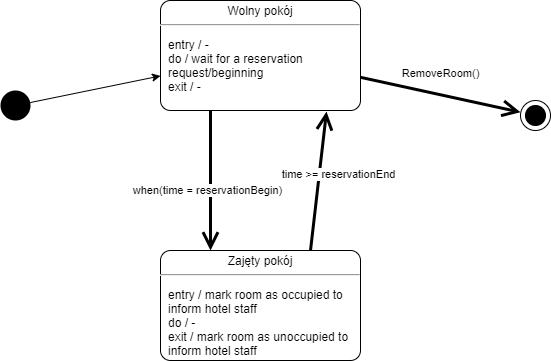

Z każdą ofertą hotelową jest związany co najmniej jeden pokój, którego
opis jest zawarty w reprezentującej go ofercie. Po utworzeniu nowego
pokoju i dodaniu go do puli pokoi związanych z daną ofertą, pokój
otrzymuje swój własny unikatowy identyfikator i przechodzi w stan
\"wolny\" oczekując na rezerwację kliencką.\
W momencie rozpoczęcia rezerwacji pokój hotelowy przechodzi w stan
\"zajęty\" - oznacza to fizyczny pobyt klienta w pokoju. Pokoje w stanie
\"zajętym\" są wyszczególnione dla obsługi hotelowej - informacja ta
może być wykorzystywana przez obsługę hotelową w celu określenia
potrzeby realizacji usług takich jak regularne sprzątanie pokoju.\
W momencie zakończenia pobytu klienta w pokoju hotelowym i upływie jego
rezerwacji pokój jest ponownie uwzględniany przy żądaniach rezerwacji
obejmujących przedział czasowy zrealizowanej rezerwacji. Informacja o
zrealizowanej rezerwacji jest usuwana w systemie hotelowym a pokój jest
oznaczany jako \"wolny\" na okres zrealizowanej rezerwacji.\
Cykl życia obiektu pokoju hotelowego kończy się w momencie jego
usunięcia z puli pokoi związanych z daną ofertą pod warunkiem, że pokój
znajduje się w stanie \"wolny\" oraz nie są przewidziane żadne jego
rezerwacje.

## Oferta pokoju

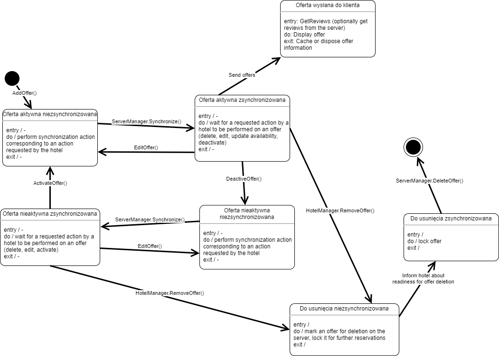

Informacje o ofercie hotelowej jak i jej dostępność są przechowywane
zarówno na serwerze jak i systemie hotelowym. Po utworzeniu nowej oferty
w systemie hotelowym informacja o poprawnym wykonaniu tej akcji musi
zostać przekazana i potwierdzona przez serwer, więc początkowym stanem
nowej oferty jest \"oferta aktywna niezsynchronizowana\". Po poprawnej
synchronizacji oferta przechodzi w stan \"oferty aktywnej
zsynchronizowanej\".\
W przypadku edycji oferty (zmiany informacji takich jak opis pokoi, cena
itp.) oferta ponownie przechodzi w stan \"oferty aktywnej
niezsynchronizowanej\" oczekującej na wykonanie żądanych przez hotel
akcji na serwerze oraz potwierdzenie ich wykonania lub informacji o
błędzie.\
Oferta aktywna zsynchronizowana może zostać zdezaktywowana, dzięki czemu
opcja tworzenia nowych rezerwacji jest tymczasowo niedostępna dla
klientów. Oferta ta przechodzi w stan \"oferty nieaktywnej
niezsynchronizowanej\" oczekującej na synchronizację tej akcji między
modułem serwerowym i modułem hotelowym. Po pomyślnej dezaktywacji oferty
przechodzi ona w stan \"oferty nieaktywnej zsynchronizowanej\"
oczekującej na ponowną aktywację lub jej edycję przez hotel. W przypadku
edycji oferta przechodzi ponownie w stan \"oferty nieaktywnej
niezsynchronizowanej\" oczekując na zakończenie procesu synchronizacji
serwera i hotelu, natomiast z przypadku aktywacji oferty jej stan
zmienia się na \"ofertę aktywną niezsynchronizowaną\" oczekującą na
potwierdzenie reaktywacji oferty i synchronizacji obu modułów.\
Oferty znajdujące się w stanie \"aktywnym zsynchronizowanym\" mogą
zostać przesłane do aplikacji klienckiej w celu ich wyświetlenia. Razem
z wysyłanymi ofertami mogą również zostać opcjonalnie wysłane recenzje
tych ofert. Oferty te są wówczas w stanie \"wysłane do klienta\" a po
zakończeniu ich wyświetlania obiekty reprezentujące oferty są niszczone
lub zachowywane po stronie aplikacji klienckiej w celu cache'ingu.\
Oferty znajdujące się w stanie \"zsynchronizowanym\" mogą zostać
permanentnie usunięte na żądanie systemu hotelowego. Oferta wówczas
przechodzi w stan \"do usunięcia niezsynchronizowana\", podczas którego
serwer wykonuje odpowiednie akcje związane z usunięciem oferty
(oznaczenie oferty do usunięcia oraz zablokowanie możliwości tworzenia
rezerwacji w ramach tej oferty) oraz informuje hotel o powodzeniu lub
błędzie. W przypadku powodzenia oferta przechodzi w stan \"do usunięcia
zsynchronizowana\" po czym obiekty reprezentujące tą ofertę są niszczone
zarówno po stronie serwera jak i systemu hotelowego.

## Rezerwacja pokoju

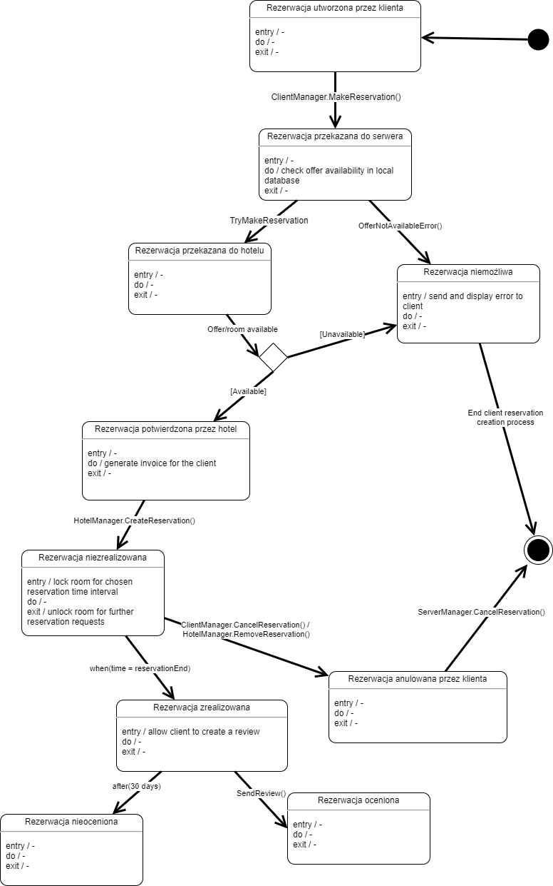

Rezerwacja pokoju hotelowego tworzona jest przez klienta w oparciu o
informacje o hotelach i udostępnionych przez nie ofert jak i dostępnych
terminach rezerwacji w ramach tych ofert za pomocą metody
`MakeReservation`. Utworzony obiekt zawierający informacje o żądanej
przez klienta rezerwacji jest w stanie \"rezerwacji utworzonej przez
klienta\".\
Po poprawnym utworzeniu obiektu reprezentującego nową rezerwację
przesyłany jest on do serwera, przechodząc w stan \"rezerwacji
przekazanej do serwera\". Serwer w oparciu o własną lokalną bazę danych
zawierającą dane związane z dostępnością ofert w określonych
przedziałach czasowych (aktualizowaną na bieżąco w oparciu o komunikaty
hoteli informujące o zmianie dostępności ofert) odpowiednio odrzuca
żądanie rezerwacji przechodząc do stanu \"rezerwacji niemożliwej\"
informując klienta o niedostępności oferty i ostatecznie niszcząc obiekt
reprezentujący rezerwację po stronie serwera.\
W przypadku dostępności oferty w wybranym przez klienta terminie w
oparciu o informacje zawarte w lokalnej bazie danych serwera żądanie
rezerwacji przechodzi w stan \"rezerwacji przekazywanej do hotelu\" w
celu dodatkowej weryfikacji dostępności terminu rezerwacji po stronie
systemu hotelowego. W przypadku niedostępności żadnego pokoju na
określony w ramach nowej rezerwacji czas, rezerwacja przechodzi w stan
\"rezerwacji niemożliwej\" informując klienta o błędzie oraz serwer o
błędzie synchronizacji lokalnej bazy danych serwera przetrzymującej
informacje o dostępności oferty z bazą danych hotelu.\
W przypadku potwierdzenia dostępności pokoju na podany przez klienta
okres, system hotelowy tworzy obiekt rezerwacji w bazie danych
za pomocą metody `CreateReservation` na skutek czego rezerwacja przechodzi
do stanu \"rezerwacji niezrealizowanej\". W przypadku anulowania rezerwacji
przez klienta przyznany przez system hotelowy pokój jest zwalniany i ponownie
uwzględniany w kolejnych żądaniach rezerwacji. Anulowana rezerwacja
przechodzi wówczas do stanu \"rezerwacji anulowanej przez klienta\".\
Po upływie czasu rezerwacji obiekt przechodzi w stan \"rezerwacji
zrealizowanej\", natomiast zarezerwowany pokój jest ponownie
uwzględniany w nowych żądaniach rezerwacji. Przed upływem 30 dni klient
może wystawić opinię oferty, w ramach zrealizowanej rezerwacji pokoju
hotelowego. Zapisywana jest wówczas recenzja klienta, natomiast obiekt
rezerwacji przechodzi wówczas do stanu \"rezerwacji ocenionej\".

# Diagramy aktywności i sekwencji

Poniżej prezentujemy diagramy sekwencji przedstawiające przebieg
komunikacji pomiędzy modułami przy realizacji najistotniejszych naszym
zdaniem funkcjonalności systemu. Uwzględnione są również błędy czy
alternatywne przebiegi komunikacji. Na diagramach wyróżnieni są
następujący aktorzy: system hotelowy (moduł hotelowy), serwer (moduł
serwera), aplikacja kliencka/ClientApp (moduł klienta). W celu
zwiększenia czytelności diagramów ignorowane są błędy wynikające z
utraty czy braku połączenia.

## Oferta

Jedną z najważniejszych funkcjonalności naszej aplikacji jest możliwość
dynamicznego zarządzania ofertami przez managera hotelu (zarządcy modułu
hotelowego). Dla każdej oferty można, więc przeprowadzić następujące
operacje:

-   Dodawanie nowej oferty do systemu

-   Usuwanie już istniejącej oferty - jeśli oferta z jakichkolwiek
    powodów przestanie być aktualna (zakończenie okresu promocji,
    wyczerpanie liczby dostępnych ofert) udostępniamy możliwość trwałego
    usunięcia jej z systemu, tak aby przestała być widoczna dla klientów

-   Edytowanie oferty - w przypadku zaistnienia konieczności modyfikacji
    już istniejącej oferty manager ma możliwość zmiany dowolnego
    parametru oferty. W tym celu posługuje się dobrze mu znanym
    formularzem dodawania nowej oferty z naniesioną bieżącą postacią
    oferty.

Przebieg komunikacji dla każdej z tych operacji prezentujemy poniżej.

### Dodawanie oferty


Dodawanie oferty to operacja między systemem hotelowym, a serwerem.
System hotelowy wysyła po walidacji lokalnej żądanie do serwera wraz z
wszystkimi informacjami o ofercie. Serwer po otrzymaniu żądania waliduje
otrzymane dane. W przypadku ich niepoprawności odsyła hotelowi stosowny błąd.
Po zwalidowaniu, nowa oferta zapisywana jest w lokalnej bazie danych serwera.
Do hotelu odsyłane jest potwierdzenie. Jeśli system hotelowy nie może otrzymać
komunikatu ponawia próbę po pewnym czasie. Powtarza to 5 razy co sekundę, po czym zarzuca
wykonywanie aktywności. W przypadku otrzymania potwierdzenia system
hotelowy kończy operacje dodaniem do swojej bazy danych oferty. W
przypadku niepowodzenia oferta nie zostaje dodana do bazy danych i
proces się kończy.

### Usuwanie oferty


Usuwanie oferty odbywa się w następujący sposób. System hotelowy wysyła
żądanie, a serwer odsyła informacje o powodzeniu operacji lub o błędzie.
Jeśli system hotelowy nie może wysłać komunikatu ponawia próbę po pewnym
czasie. Powtarza to 5 razy co sekundę, po czym zarzuca wykonywanie
aktywności.

### Edytowanie oferty


Edycja oferty zaczyna się od zmodyfikowania przez użytkownika systemu 
hotelowego formularza już istniejącej w systemie oferty. Zmiany są następnie
wstępnie walidowane. W przypadku nieudanej walidacji użytkownik jest z
powrotem odsyłany do formularza. W przypadku udanej walidacji system
hotelowy wysyła żądanie wprowadzenia zmian do serwera który jeszcze raz
waliduje otrzymane dane. Jeśli to się nie powiedzie odsyła błąd i proces
się kończy. W przypadku przejścia walidacji pomyślnie system uaktualnia
dane i odsyła informacje o powodzeniu operacji, po czym system hotelowy
uaktualnia swoje dane. Jeśli system hotelowy nie może wysłać komunikatu
ponawia próbę po pewnym czasie. Powtarza to 5 razy co sekundę, po czym
zarzuca wykonywanie aktywności.

### Wyszukiwanie oferty


Wyszukiwanie oferty w systemie jest 2 etapowe. Pierwszy etap to
uzupełnienie danych wyszukiwania hotelu. Wypełniony formularz jest
przesyłany do serwera. Tam odbywa się jego walidacja. W przypadku
nieprawidłowości w formularzu do użytkownika zostaje przesłany błąd w
postaci kodu 400 wraz z informacją o błędnie wypełnionym polu. Jeśli
formularz został wypełniony poprawnie zwracana jest lista hoteli. W
przypadku gdy lista jest niepusta możemy wybrać jeden z hoteli, aby
poznać szczegółowe informacje na jego temat i uzyskać dostęp do
udostępnionych przez niego ofert.\
Drugi etap to wyszukiwanie ofert spośród tych udostępnionych przez
wybrany we wcześniejszych krokach hotel. Wyszukiwanie to przebiega
analogicznie do wyszukiwania hoteli. Użytkownik ma możliwość
ograniczenia listy ofert poprzez wypełnienie danych do wyszukiwania
ofert. Formularz jest przesyłany do serwera, gdzie odbywa się jego
walidacja. W przypadku nieprawidłowości do użytkownika zostaje przesłany
błąd w postaci kodu 400 wraz z informacją o błędnie wypełnionym polu.
Jeśli formularz został wypełniony poprawnie zwracana jest lista ofert. W
przypadku gdy lista jest niepusta możemy wybrać jedną z ofert, aby
poznać jej szczegóły i przejść do dalszej interakcji.\
Walidacja formularza i ewentualnie zwracane błędy w postaci kodów 400
nie zostały naniesione na diagram w celu zachowania jego czytelności.

## Rezerwacja

Podstawą systemu jest możliwość składania rezerwacji przez klientów. W
poniższej podsekcji przyjrzymy się komunikacji między
modułami podczas tworzenia i anulowania rezerwacji przez klienta.

### Tworzenie rezerwacji


Proces tworzenia rezerwacji zaczyna się po wybraniu przez użytkownika
aplikacji klienckiej hotelu oraz oferty, w ramach której ma być
utworzona nowa rezerwacja. Prośba o utworzenie nowej rezerwacji jest
przesyłana do serwera, który sprawdza czy oferta jest dostępna w oparciu
o własne dane uzyskane z hotelu. W przypadku braku wolnego terminu
zwracany jest błąd i kończony jest proces tworzenia rezerwacji. Jeśli
jednak z lokalnych danych wynika możliwość utworzenia rezerwacji,
przesyłane jest żądanie do hotelu o wstępne utworzenie rezerwacji. Hotel
w oparciu o swoje dane ponownie sprawdza dostępność oferty. W przypadku
gdy oferta nie jest dostępna w wyznaczonym czasie zawracany jest błąd,
który oznacza desynchronizację między danymi hotelu a serwera
opasującymi dostępność oferty. W efekcie serwer odsyła użytkownikowi
informację o nieudanej rezerwacji oraz natychmiastowo wykonuje proces
związany z synchronizacją danych. W przypadku gdy hotel będzie mógł
przyporządkować odpowiedni pokój na podany okres czasowy, tworzy on
lokalny wpis w bazie danych związany z tą rezerwacją. Klient może anulować
rezerwację oraz wysłać do serwera odpowiedni komunikat, który następnie
jest przesyłany do hotelu. Hotel usuwa wówczas utworzony wpis rezerwacji
i zwraca odpowiednią informację serwerowi, która jest propagowana do
klienta.

### Anulowanie rezerwacji


Po wybraniu swojej rezerwacji klient ma możliwość anulowania jej.
Aplikacja Kliencka wysyła wtedy żądanie usunięcia rezerwacji do serwera,
który przekazuje ją odpowiedniemu hotelowi. Hotel usuwa ze swojej bazy
danych rezerwacje i przesyła potwierdzenie do serwera, który również
usuwa rezerwację ze swojej bazy danych i przesyła potwierdzenie do
klienta. W przypadku wystąpienia błędu na którymkolwiek z tych etapów,
przesyłany jest błąd w stronę klienta i żadne zmiany w bazie danych nie
są dokonywane. Jeśli któryś z modułów nie może wysłać komunikatu ponawia
próbę po pewnym czasie. Powtarza to 5 razy co sekundę, po czym zarzuca
wykonywanie aktywności.

### Tworzenie rezerwacji lokalnie


Istnieje również możliwość, że klient przyjdzie do hotelu bez rezerwacji, 
chcąc dokonać rezerwacji bezpośrednio na miejscu. System
hotelowy może zarezerwować pokój w imieniu klienta. Po takiej rezerwacji
nie może zostać strworzona opinia, gdyż serwer nie wie o istnieniu
takowej. ID klienta w bazie danych systemu hotelowego jest IDUser
hotelu. Hotel nie przetrzymuje wtedy żadnych informacji o kliencie, ale
za to klient nie musi tworzyć nowego konta. System hotelowy próbuje
synchronizować się z serwerem i gdy nie ma żadnych przeciwności 
(np. nie ma rezerwacji które były na serwerze na dany okres, a system
hotelowy o nich nie wiedział) dodaje rezerwację do lokalnej bazy danych.

## Opinia

W celu umożliwienia oceny danej oferty klienci (użytkownicy aplikacji
klienckiej) mają możliwość dodawania swoich opinii do ofert z których
ostatnio skorzystali. Poniżej przedstawiamy proces dodawania takiej
opini do systemu.

### Dodawanie opinii


Klient może dodać opinie do wybranej przez siebie rezerwacji którą już
odbył. W tym celu wypełnia formularz w aplikacji klienckiej, który jest
walidowany (w przypadku niepowodzenie proszony jest o naniesienie poprawek 
w formularzu). Po przejściu przez walidację żądanie wysyłane jest do
serwera, który ponownie je waliduje i odsyła informacje czy operacja się
powiodła czy nie.

## Synchronizacja


 

W dowolnym momencie dane między hotelem a serwerem dotyczące dostępności
ofert mogą się zdesynchronizować. Może to wynikać np. z błędów
systemowych/sprzętowych po stronie serwera powodujących utratę danych,
przeorganizowanie przyporządkowań pokoi do rezerwacji czy utworzenia
nowej, anonimowej rezerwacji w hotelu niezależnej od systemu. W celu
zsynchronizowania danych, zarówno serwer jak i hotel mogą rozpocząć
procedurę synchronizacji danych w odniesieniu do konkretnej oferty
hotelowej. Przesyłane są wówczas dane zawierające przedziały czasowe
niedostępności ofert odpowiednio wyznaczone przez hotel.

# Hotel-Serwer <a name="7"></a>

## Zarządzanie ofertami i pokojami

### `/offers`

**Pobieranie listy ofert**

```yaml
/offers:
    get:
    ...
```

**Dodawanie nowej oferty**

```yaml
/offers:
  post:
    description: Add new offer
    body:
      application/json:
        type: offer
        example: |
          {
            "offerTitle": "Awesome offer",
            "costPerChild": 50,
            "costPerAdult": 80,
            "maxGuests": 5,
            "description": "Apartment overlooking the sea",          
            "pictures": [],
            "rooms": ["12A”, "14B”]
          }
    responses:
      200:
      #optional - return offerID
```

Proces dodawania nowej oferty zaczyna się od wypełnienia odpowiedniego
formularza. Następnie dokonywana jest wstępna walidacja formularza po
stronie systemu hotelowego. Jeżeli nie wykryto żadnych błędów, następuje
odwołanie do metody `POST /offers` i przesłanie w jej ciele wszystkich
informacji definiujących ofertę. Są to kolejno:

-   `offerTitle` – nazwa oferty,

-   `costPerChild` – koszt skorzystania z oferty przez dziecko; powinien być
    większy od 0; przyjęta precyzja to 0.01,

-   `costPerAdult` – koszt skorzystania z oferty przez osobę dorosłą;
    powinien być większy od 0; przyjęta precyzja to 0.01,

-   `maxGuests` – maksymalna liczba osób dla której przeznaczona jest
    oferta,

-   `description` – bardziej kwiecisty opis oferty,

-   `offerPreviewPicture` – miniaturka oferty,

-   `pictures` - zdjęcia związane z dodawaną ofertą,

-   `rooms` – lista numerów pokoi związanych z daną ofertą; lista może być
    pusta; istnieje możliwość dodania pokoju do oferty po jej stworzeniu.

Manager hotelu ma możliwość późniejszej edycji oferty i wprowadzenia dokładnych wartości.

<!-- dlaczego dwie listy, nie jedna ze znacznikiem isActive? -->
<!-- do uzupełnienia -->
Endpoint służy do przeglądania ofert, które zostały stworzone w hotelu,
który wysyła zapytanie. Lista jest zwracana w dwóch częściach:

-   `activeOffers` – zawiera wszystkie oferty z ustawionym znacznikiem `isActive`,

-   `inactiveOffers` – zawiera wszystkie oferty, które nie mają ustawionego
    znacznika `isActive`.

### `/offers/{offerID}`

**Pobieranie oferty**

```yaml
/offers:
  /{offerID}:
    get:
      description: Gets information related to a specific offer with ID equal to offerID
      responses:
        200:
          body:
            application/json:
              type: |
                {
                  "isActive": boolean,
                  "costPerChild": double,
                  "costPerAdult": double,
                  "maxGuests": int,
                  "description": string,
                  "pictures": file[]
                }
        401:
          description: Offer does not belong to this hotel
        404:
          description: Offer not found
  
```
Hotel w każdym momencie może pobrać szczegółowe informacje o dowolnej własnej ofercie.

**Usuwanie oferty**

```yaml
/offers:
  /{offerID}:
    delete:
      descritpion: Server marks the offer as deleted.
      responses:
        200:
        401:
          description: Offer does not belong to this hotel
        404:
          description: Offer not found
        409:
          description: Unable to delete offer
          body:
            application/json:
              example: |
                { "error": "There are still pending reservations for this offer" }
```

Punkt końcowy komunikacji, który umożliwia "usunięcie" rezerwacji – tzn.
ustawienie znacznika `isDeleted` na true. Usunąć można wyłącznie ofertę,
która jest niektywna (patrz: modyfikacja oferty) <!-- dodać odnośnik -->
oraz w systemie nie znajdują się żadne niezrealizowane w jej ramach rezerwacje.
Innymi słowy, aby oferta została usunięta, należy ją najpierw dezaktywować, a
następnie poczekać, aż wszystkie rezerwacje do niej przypisane zostaną
zrealizowane. Zmiana znacznika jest nieodwracalna, oferty raz usuniętej
nie można przywrócić.

W efekcie tej operacji oferta nie jest uwzględniana w wyszukiwaniach
realizowanych przez klienta. Hotel natomiast ma do niej dostęp za pośrednictwem
metody `/offers GET` (wówczas warto przy wyświetlaniu taką ofertę wyróżnić
odpowiednim znacznikiem, np "archived").
Oferty nie powinny być fizycznie usuwane z systemu ze względu na zawarte do nich
referencje np. w opiniach i rezerwacjach. Jeśli wystąpi taka konieczność, należy
robić to ręcznie i ostrożnie.

Próba usunięcia oferty aktywnej lub takiej, która posiada niezrealizowane
rezerwacje kończy się niepowodzeniem; żadne dane nie powinny zostać zmienione.


**Modyfikacja oferty**

```yaml
/offers:
  /{offerID}:
    patch:
      descritpion: Server modifies offer.
      body:
        application/json:
          { 
            "isActive": boolean,
            "offerTitle": string,
            "offerPreviewPicture": file,
            "description": string,
            "offerPictures": file[]
          }
      responses:
        200:
        401:
          description: Offer does not belong to this hotel
        404:
          description: Not found
```

W ramch modyfikacji oferty możemy ją dezaktywować. W ten sposób uniemożliwiamy jej odnalezienie w wyszukiwarce.
Oferta taka nie znika – wszystkie przypisane do niej rezerwacje są ważne, natomiast
niemożliwe jest stworzenie nowych.

### `/offers/{offerID}/rooms`
<!-- 
**Lista pokojów z ofertami**

```yaml
/offers:
 /rooms:
        get:
            queryParameters:
                roomNumber:
```

Enpoint zwraca listę wszystkich pokoi w hotelu wraz z listą ofert, do
których jest przypisany.

Parametr `roomNumber` jest opcjonalny i stanowi filtr nałożony na wyniki.
Jeżeli został przekazany, w liście znajduje się maksymalnie jeden pokój
o numerze `roomNumber`. Jeżeli pokój o takim numerze nie istnieje, zwracana
jest pusta lista.
pusta lista czy kod błędu? tak samo niżej. -->

**Lista pokojów przypisanych do oferty**

```yaml
/offers:
  /{offerID}:
    /rooms:
      get:
        description: Lists all rooms related to the hotel offer
        queryParameters:
          roomNumber:
            required: false
            type: string
            description: Optional filter on room number that is applied after the query has finished
            example: 13A
        responses:
          200:
            body:
              application/json:
                example: |       
                  [
                    {
                      "roomID": 5,
                      "hotelRoomNumber": "13A"
                    },
                    {
                      "roomID": 7,
                      "hotelRoomNumber": "16"
                    }
                  ]
          401:
            description: Offer does not belong to this hotel     
          404:
            description: Offer not found
```

Endpoint umożliwia uzyskanie listy wszystkich pokojów przypisanych do
oferty o danym ID.

Parametr `roomNumber` jest opcjonalny i stanowi filtr nałożony na wyniki.
Jeżeli został przekazany, w liście znajduje się maksymalnie jeden pokój
o numerze `roomNumber`. Jeżeli pokój o takim numerze nie jest powiązany
z ofertą, zwracana jest pusta lista.

**Dodawanie pokojów do oferty**

```yaml
/offers:
  /{offerID}:
    /rooms:
      post:
        description: Add a room associated with hotel offer.
        body:
          application/json:
            type: object
            properties:
              roomID: integer
            example: |
              {
                "roomID": 21
              }
        responses:
          200:
          401:
            description: Offer does not belong to this hotel 
          404:
            description: Offer not found
```

Do nieusuniętej oferty można dodać pokój, przekazując jego ID. Pokój musi już
istnieć w systemie; należy go dodać odwołując się do `/rooms POST`. Jeden
pokój można powiązać z wieloma ofertami.

**Usuwanie pokojów z oferty**

```yaml
/offers:
  /{offerID}:
    /rooms:
      /{roomID}:
        delete:       
          description: Removes room from the offer
          responses:
            200:
            401:
              description: Offer or room does not belong to this hotel   
            404:
              description: Offer or room not found
```

Z oferty możliwe jest również usunięcie przypisanego pokoju. Wówczas
pozostaje on w systemie – usunięte jest jedynie odpowiednie powiązanie (np. w tabeli OfferHotelRooms).
Z oferty można odwiązać pokój niezależnie od liczby i stanu rezerwacji
do niego przypisanych.
<!-- 
**Lista wszystkich pokojów**

```yaml
/offers:
    /rooms:
        get:
            queryParameters::
                roomNumber:
                ...
``` -->

### `/rooms`

**Lista wszystkich pokojów**

```yaml
/rooms:
  get:
    is: [pageable]
    description: Lists all rooms 
    queryParameters:
      roomNumber:
        required: false
        type: string
        description: Optional filter on room number that is applied after the query has finished
        example: 13A
    responses:
      200:
        body:
          application/json:
            example: |
              [
                {
                  "roomID": 5,
                  "hotelRoomNumber": "13A"
                },
                {
                  "roomID": 7,
                  "hotelRoomNumber": "16"
                }
              ]
      400:
        body:
          application/json:
          description: An error containing message describing the type of error
            example: |
              {
                "error": "Room number not found"
              }
```

Lista zawiera wszystkie pokoje znajdujące się w hotelu.

Parametr `roomNumber` jest opcjonalny i stanowi filtr nałożony na wyniki.
Jeżeli został przekazany, w liście znajduje się maksymalnie jeden pokój
o numerze `roomNumber` – w ten sposób uzyskujemy ID jednego pokoju.
Jeżeli pokój o takim numerze nie istnieje w hotelu, zwracana jest pusta lista.

**Dodawanie pokojów**

```yaml
/rooms:
  post:
    description: Add a room not associated with any offer. (HotelRoom table)
    body:
      application/json:
        type: object
        properties:
          hotelRoomNumber: string
        example: |
          {
            "hotelRoomNumber": "12F"
          }
    responses:
      200:
        description: Room added successfully.
        body:
          application/json:
            type: object
            properties:
              roomID: integer
            example: |
              {
                "roomID": 14
              } 
```

Dodany do systemu pokój nie jest powiązany z żadną ofertą (brak wpisów w tabeli
OfferHotelRooms). Numer pokoju powinien być unikalny w zakresie hotelu. Zwracane
ID jest unikalne w zakresie całego systemu.

**Usuwanie pokoju**

```yaml
/rooms:
  /{roomID}:
    delete:
      descritpion: Serwer usuwa pokój o wskazanym ID. (Usuwany jest wpis w tabeli HotelRoom)
      responses:
        200:
        401:
          description: Room does not belong to this hotel
        404:
          description: Room not found
        409:          
          body:
            application/json:
              description: Unable to delete room
              example: |
                {
                  "error": "There are still pending reservations for this room that cannot be moved"
                }
```

Usuwanie polega na sprawdzeniu, czy w systemie są jeszcze niezrealizowane rezerwacje w ramach tego pokoju.
Jeśli tylko to możliwe, przenosimy rezerwacje do innych pokoi zebranych w ramach tej samej oferty.
Jeśli nie jest to możliwe – zwracamy błąd 409 i nie podejmujemy żadnych działań.
Jeśli rezerwacje da się przenieść lub nie ma żadnych rezerwacji – we wszystkich rezerwacjach (tabela z rezerwacjami),
które wskazują na rozpatrywany pokój zmieniamy pokój na NULL (należy rozwiązać problem ze spójnością referencyjną)
i usuwamy pokój (tabela HotelRoom).
<!-- na NULL?? -->

## Zarządzanie rezerwacjami

**Lista rezerwacji**

```yaml
/reservations:
  get:
    description: fetches current (and future) reservations made by clients and information regarding these clients
    queryParameters:
      currentOnly:
        required: false
        type: boolean
        description: get reservations that are currently underway or all reservations (including ones that begin in the future)
      roomID:
        required: false
        type: int
        description: get reservations connected with room with ID equal to roomID parameter
    responses:
      200:
        body:
          application/json:
            description: Returns an array of objects containing reservation and client information related to a hotel room reservation.  
            type: |
              [
                {
                  reservation:
                  {
                    reservationID: int,
                    hotelRoomNumber: string,
                    offerID: int,
                    fromTime: date,
                    toTime: date,
                    childrenCount: int,
                    adultsCount: int
                  }
                  client: 
                  {
                    clientID: int,                    
                    name: string,
                    surname: string
                  }
                }
              ]
      400:
        body:
          application/json:
            description: An error containing message describing the type of error
            example: |
              {
                "error": "Room with ID equal to roomID parameter does not exist"
              }
```

Hotel może pobrać listę wszystkich rezerwacji (będących w trakcie i oczekujących na realizację).
Wraz z każdą rezerwacją zwracane są dane klienta, który ją złożył.

## Dane hotelu

**Pobieranie danych**

```yaml
/hotelInfo:
  get:
    description: Show info about hotel
    responses:
      200:
        body:
          application/json:
            type: |
              {
                "country": string, 
                "city": string,
                "hotelPreviewPicture": file,
                "hotelName": string,
                "hotelDesc": string,
                "hotelPictures": file[]  
              }
```

Endpoint służący do pobrania danych o hotelu znajdujących się na serwerze.

**Uaktualnianie danych**

```yaml
/hotelInfo:
  patch:
    description: Update info about hotel  
     body:
        application/json:
          { 
            "hotelDesc": string,
            "hotelPreviewPicture": file,
            "hotelPictures": file[],
            "hotelName": string
          }
      responses:
        200:
```

Endpoint służący do aktualizacji danych reprezentatywnych hotelu.

# Klient-Serwer

Komunikacja pomiędzy klientem (modułem aplikacji klienckiej), a serwerem
odbywa się przy użyciu połączeń HTTP i REST API. Poniżej opisane są
wszystkie endpointy oraz związane z nimi żądania i odpowiedzi HTTP
zamodelowane w RAML.

## Autentykacja i autoryzacja

Wszystkie endpointy serwera (poza endpointem związanym z logowaniem)
zabezpieczone są przez schemat autentykacji opierający się na tworzeniu
tokenów autentykacyjnych dla każdego klienta w momencie gdy dostarczone
zostaną poprawne dane logowania. W każdym zapytaniu klienta powinien być
dołączony nagłówek "x-session-token", którego wartością jest otrzymany
przez klienta token autentykacyjny. Token ten jest zawsze tworzony po
stronie serwera. Generowany token ma format JSON i jego
przykładowa zawartość jest podana na zdjęciu poniżej. Token
"serverSessionToken" jest obiektem JSON zawierającym właściwość "id",
której wartość jednoznacznie identyfikuje klienta w bazie danych serwera.


Poniżej znajduje się dokładny opis schematu autentykacji w języku RAML
oraz zwracane kody błędu związane z niepowodzeniem procesu
uwierzytelnienia klienta. Każda wiadomość związana z błędem zawiera
dokładny opis zawierający czytelne dla człowieka szczegóły dotyczące
tego błędu.


<br />


## Rejestracja/logowanie klienta i pobieranie danych o kliencie

Rejestracja klientów do serwisu odbywa się poprzez bezpośredni kontakt
z administratorem modułu serwerowego i prośbą utworzenia nowego wpisu w bazie
danych do tabli przetrzymującej informacje o wszystkich kontach użytkowników.\
Poniżej przedstawiona została implementacja logowania klientów w przypadku
procesu autentykacji przeprowadzanej przez serwer w oparciu o lokalną
tablicę sekretów w bazie danych. Jako login klienta przyjmowany jest jego obecna nazwa
użytkownika (username). Porównywane są wówczas przesłane przez
klienta login i hasło z danymi przechowywanymi w takiej tabeli i
zwracany jest odpowiednio token przechowujący ID klienta. Zwracane ID
klienta odpowiada numerowi rekordu w tabeli bazy danych serwera, w której
przetrzymywane sa informacje o wszystkich użytkownikach.\
Do zarządzania danymi związanymi z kontem klienta oraz logowania do
serwisu służą odpowiednio endpointy: `/Client` oraz `/Client/login`.
Endpoint `/Client` jest zabezpieczony wyżej zdefiniowanym schematem
autentykacji, natomiast endpoint służący do logowania nie wymaga
przesyłania nagłówka `x-session-token`.

### `/Client`


<br />


Endpoint ten definiuje 2 metody HTTP: `GET` oraz `PATCH`. Metoda `GET`
pobiera informacje o aktualnie zalogowanym użytkowniku, natomiast metoda
`PATCH` udostępnia możliwość zmiany danych użytkownika takich jak e-mail
lub nazwa użytkownika. W przypadku niepowodzenia metody `PATCH` wysyłany
jest obiekt JSON z właściwością `"errorDescription"` opisującą rodzaj
błędu.

### `/Client/login`


<br />


Endpoint ten nie jest zabezpieczony przez schemat autentykacji - nie
jest wymagane dołączanie tokenu do nagłówka `"x-session-token"`. Endpoint
służący do logowania się użytkowników do systemu za pomocą ustalonego
przy rejestracji loginu i hasła. Wysłane przez klienta dane logowania
jako metoda POST sprawdzane są następnie przez serwer. W przypadku
sukcesu tworzony jest `"serverSessionToken"` zawierający `"id"` logującego
się klienta. W celu dalszej autentykacji klienta token ten (jako
zserializowany obiekt JSON w plain-text) jest dołączany do
kolejnych żądań HTTP w nagłówku `"x-session-token"`. W przypadku
niepowodzenia serwer zwraca odpowiedni kod błędu oraz dokładny opis
błędu w ciele odpowiedzi HTTP. Powyżej znajdują się szczegółowe opisy
typów danych oraz żądań i odpowiedzi HTTP w języku RAML.

## Wyszukiwanie hoteli

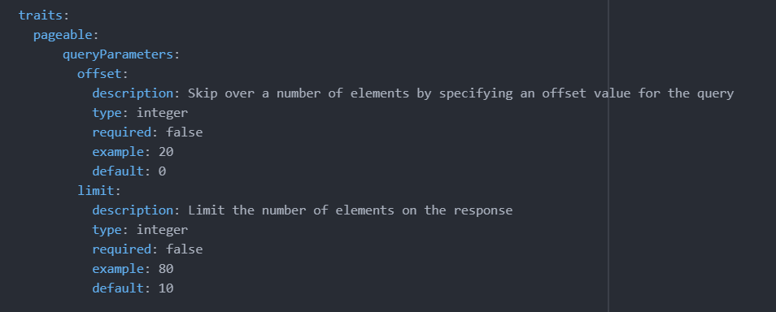

Opisane w tej i kolejnej sekcji endpointy `/Hotel` i
`/Hotel/{HotelID}/Offer` korzystają z pagingu. Rozwiązanie to zwiększa
czytelność zwracanych list ograniczając liczbę wyników do ilości
zdefiniowanej przez parametr `limit`. Przeglądanie kolejnych stron odbywa
się przez modyfikacje parametru `offset`.

### `/Hotel`

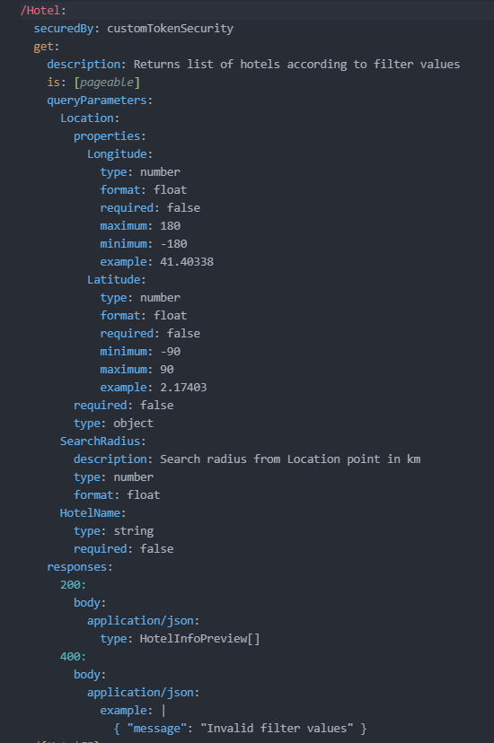

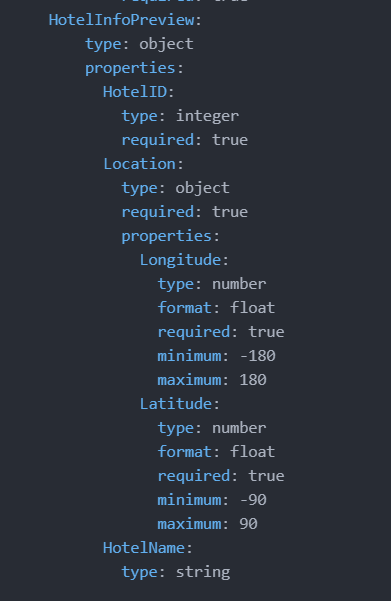

Endpoint służy do przeglądania hoteli współpracujących z systemem.
Dostęp jest stosownie chroniony przez customSecurityToken. W celu
zwiększenia przejrzystości zastosowano paging ograniczający ilość
rekordów znajdujących się na aktualnie przeglądanej stronie. Ponadto
użytkownik ma możliwość wyszukiwania wymarzonego hotelu po zestawie
filtrów takich jak lokalizacja, czy nazwa hotelu. Wynikiem udanego
wyszukiwania hoteli jest kod 200 wraz z listą zawierającą obiekty typu
HotelInfoPreview. Każdy z elementów listy składa się wyłącznie z
kluczowych informacji na temat hotelu co poprawia czytelność wyników
wyszukiwania. Są to odpowiednio opis hotelu i jego lokalizacja.
Naciśnięcie na jeden z elementów listy powoduje przeniesienie do
enpoint'u `/Hotel/{HotelID}` gdzie uzyskujemy dostęp do dalszych
interakcji z wybranym przez nas hotelem.\
W przypadku niepowodzenia zwracany jest błąd o kodzie 400 wraz ze
stosownym opisem.

### `/Hotel/{HotelID}`

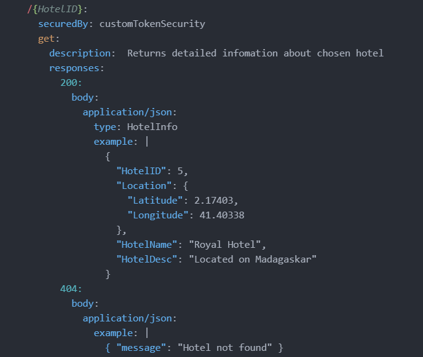

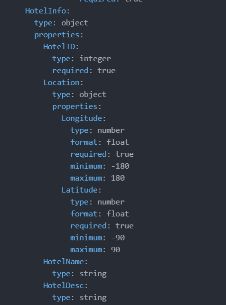

Po wybraniu z listy konkretnego hotelu mamy dostęp do większej ilości
informacji w ramach przygotowanego przez hotel opisu. O powodzeniu
jesteśmy również informowani przez kod 200. Uzyskujemy także dostęp do
dalszych działań związanych z wybranym przez nas hotelem. W przypadku
wybrania ID nieistniejącego hotelu użytkownik jest informowany o błędzie
przez kod 404 i stosowny komentarz.

## Wyszukiwanie ofert

### `/Hotel/{HotelID}/Offer`

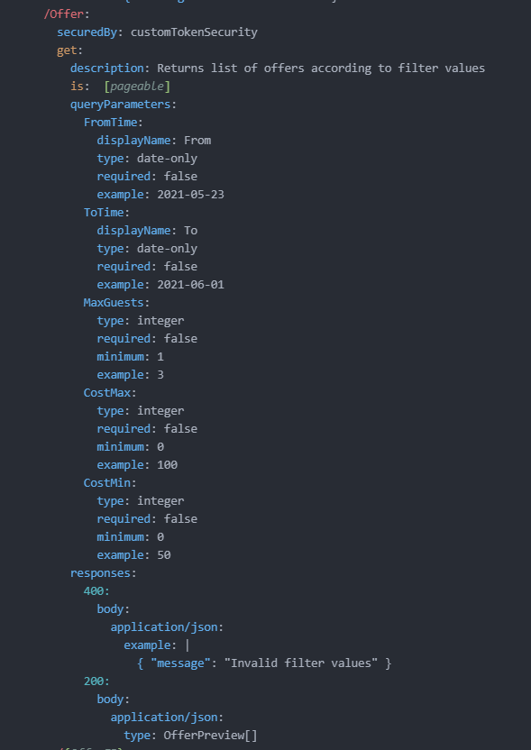

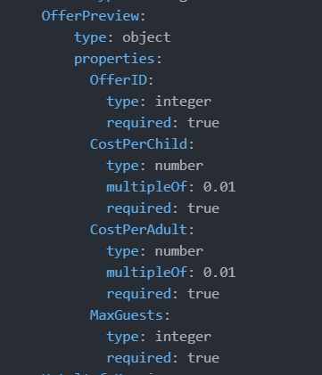

Zadaniem tego endpointu jest prezentacja ofert należących do wybranego
przez użytkownika we wcześniejszych krokach hotelu. Analogicznie jak w
przypadku opisanego wyżej endpointu `/Hotel` w celu podniesienia
przejrzystości zastosowano paging i wyświetlane są jedynie
najistotniejsze informacje dotyczące prezentowanych ofert. Między
innymi: koszt skorzystania z oferty dla dziecka i osoby dorosłej, a
także maksymalna liczba gości, która może skorzystać z oferty.
Użytkownik aplikacji przy wyszukiwaniu wymarzonej oferty ponownie może
skorzystać z zestawu filtrów. Poprawne wyszukiwanie ofert kończy się,
więc zwróceniem kodu 200 wraz z listą obiektów typu OfferPreview
przedstawionych na powyższym schemacie. O niepoprawnym użyciu filtrów
czy błędzie innej postaci informuje kod 400 wraz ze stosownym
komentarzem.

### `/Hotel/{HotelID}/Offer/{OfferID}`

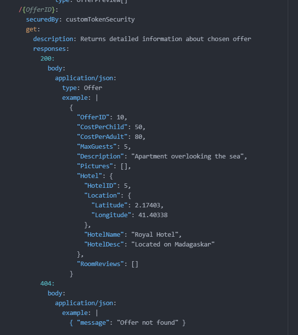

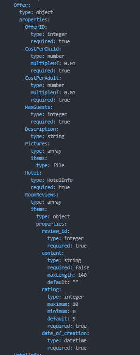

Po wybraniu z listy konkretnej oferty możemy poznać jej szczegóły takie
jak opis, zdjęcia czy opinie innych użytkowników aplikacji, którzy
skorzystali już z tej oferty. Przykładowy obiekt Offer zwracany w
przypadku poprawnego OfferID został przedstawiony na powyższej grafice
ilustrującej cały endpoint. W przypadku wskazania oferty o
nieprawidłowym OfferID jesteśmy informowani o błędzie przez kod 404 wraz
ze stosownym komentarzem.

## Zarządzanie rezerwacjami

Ze szczególną uwagą warto przyjrzeć się komunikatom wymienianym pod
adresem `/Reservations/`. Ze względu na to, że
potencjalna strona z listą rezerwacji użytkownika stanowi jego \"centrum
dowodzenia wszechświatem\" i za jej pośrednictwem user wykonuje wiele
akcji, warto dobrze zrozumieć wymianę komunikatów odbywającą się w tym
miejscu.

### `/Reservations`

Pod tym adresem można otrzymać wszystkie rezerwacje klienta wraz z
ewentualnymi przypisanymi do nich opiniami. `HotelID` i `ReservationID`
reprezentują wspólnie jedną rezerwację. Są niejako złożonym kluczem
głównym dla rezerwacji. Jeżeli dana rezerwacja nie posiada wystawionej
opinii, właściwość `ReviewID` nie jest zawarta w przesłanych danych
(patrz przykład przy `/Reservations`]).

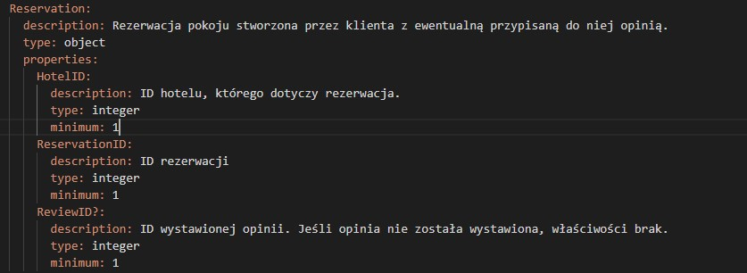

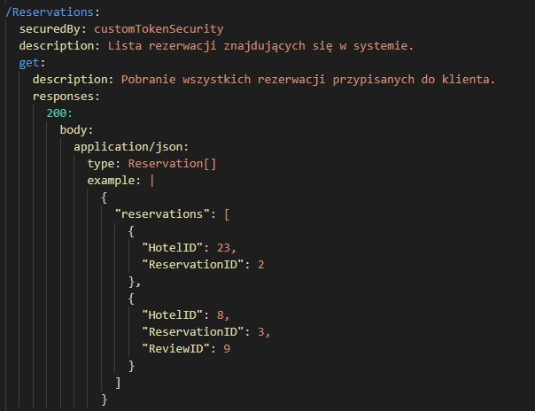

Należy zauważyć, że nie jest to pełna lista informacji gotowa do wyświetlenia,
a raczej lista powiązanych ze sobą ID. Aby otrzymać taką listę, należy
odwołać się do adresu `/Reservations/{HotelID}/{ReservationID}`
reprezentującego konkretną rezerwację - należy to wykonać dla *każdej*
otrzymanej rezerwacji.

Przesłanie prośby o dodanie nowej rezerwacji odbywa się przez metodę
`POST`. Wysyła się obiekt `ReservationInfo` zawierający wszystkie
niezbędne informacje.

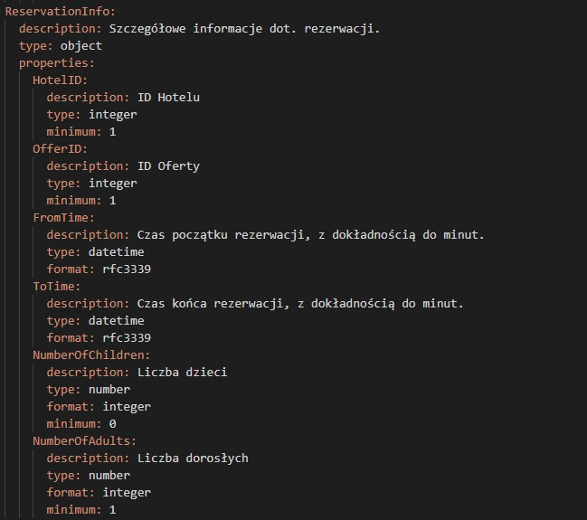

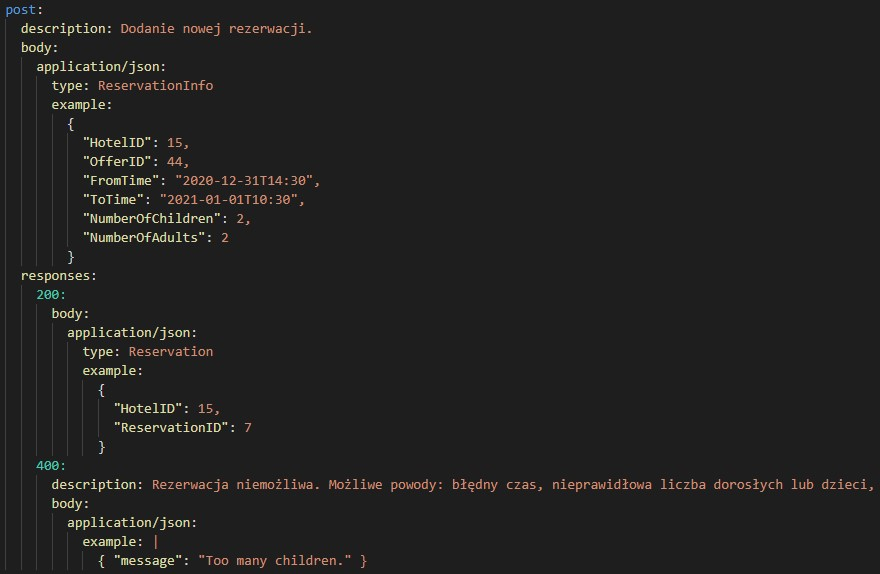

### `/Reservations/{HotelID}/{ReservationID}`

Pod tym endpointem można znaleźć szczegółowe informacje dotyczące
konkretnej rezerwacji `ReservationID` w hotelu `HotelID` bądź ją usunąć.

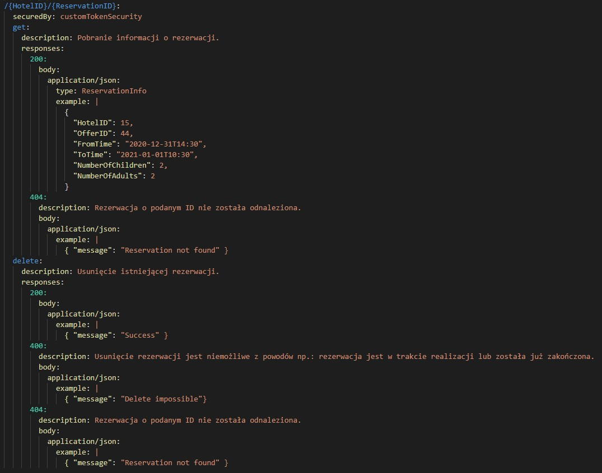

## Zarządzanie opiniami

Endpointy poniżej służą użytkownikowi do zarządzania swoimi opiniami na
temat rezerwacji które odbył. Oba są zabezpieczone w sposób
przedstawiony na początku tego rozdziału.

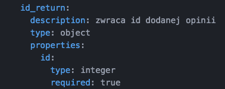

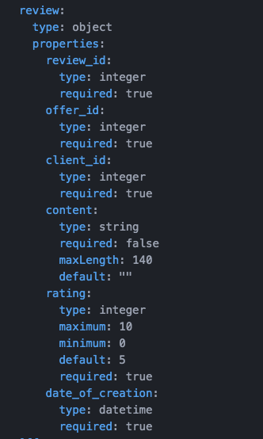

Powyżej widzimy szczegółowy opis typów używanych przez opisane poniżej
Endpointy w języku RAML. typ review służy do przesyłani informacji o
Opinii i jest odpowiednikiem klasy Review w systemie. Natomiast
id_return służy do przesyłania id świeżo dodanej opinii do klienta.

### `/Review`

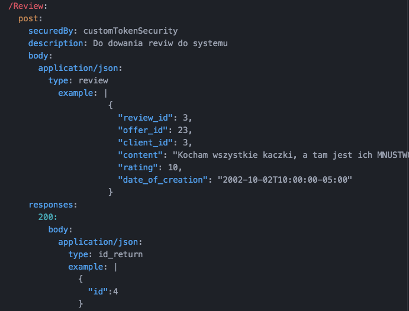

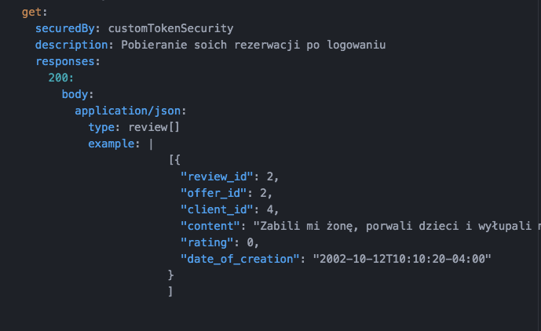

Endpoint służy do pobierania wszystkich Opinii klienta oraz dodawaniu
nowych. Metoda POST nie znajduje się w `/Review/{id}`, gdyż nie znamy
jeszcze id Opinii. Zostanie ona przyznana przez serwer i odesłana do
klienta za pomocą id_return. Aplikacja kliencka zapisuje po uzyskaniu id
zapisuje nową Opinię razem z innymi. Metoda GET jest tutaj używana zaraz
po logowani Klienta w celu pobrania jego opinii.

### `/Review/{id}`


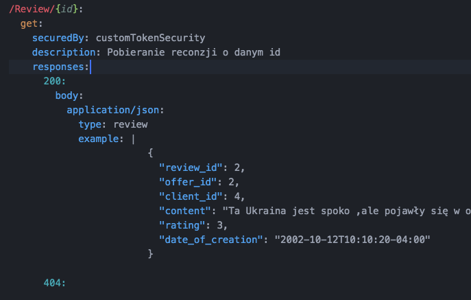

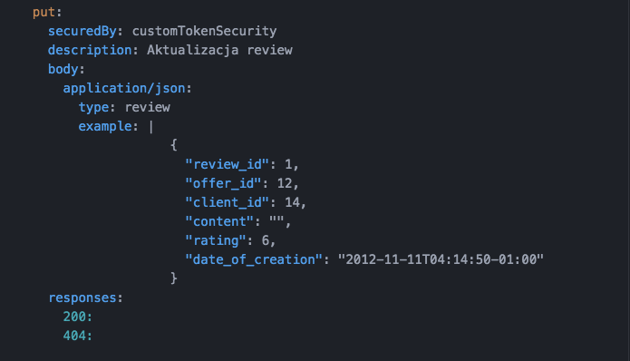


Endpoint służy do zarządzania pojedynczą Opinią.

Metoda GET służy pobieraniu pojedynczej Opinii z Serwera.

Metod PUT służy do edytowani istniejących w systemie Opinii. Zastępuje
ona dane w Serwerze danymi przesłanymi z Aplikacji Klienckiej.

Metoda DELETE natomiast usuwa z systemu Opinię o danym id.


# Scenariusze testowe

Scenariusze przedstawiają proponowane testy do przeprowadzania na
systemie. Podają one na początku dane wejściowe, następnie przebieg
wykonywania zadania oraz ewentualne scenariusze alternatywne (w razie
błędów). Scenariusze są przygotowane w ten sposób aby można było łatwo
przetestować poprawność zaimplementowanego systemu pod kątem komunikacji - poniższe scenariusze pokrywają jej całość.

## Dodawanie nowej oferty

Manager hotelu dodaje nową ofertę. Moduły pomiędzy którymi odbywa się
komunikacja: Hotel, Serwer. Hotel w ramach którego manager dokonuje
operacji ma następujące ID:

-   HotelID: 1

Formularz został wypełniony następującymi danymi:

-   Cost per child: 80

-   Cost per adult: 120

-   Max guests: 3

-   Description: Very very very good offer

Następuje wymiana wiadomości:

-   Hotel &#129030; Serwer `OFFER_ADD_REQUEST`\
    Do modułu serwerowego przesłany zostaje zserializowany obiekt
    oferty. Oferta jest walidowana, a następnie dodawana do lokalnej
    bazy danych serwera. Powiedzmy, że oferta zostaje dodana do
    odpowiedniej tabeli z następującym ID:

    -   OfferID: 3

-   Hotel &#129028; Serwer `OFFER_ADD_SUCCESS`\
    W odpowiedzi odsyłany jest OfferID pod jakim oferta została dodana.
    Moduł hotelowy następnie dodaje ofertę pod tym samym ID do swojej
    lokalnej bazy danych.

Wynikiem pomyślnego zakończenia operacji jest dodanie do bazy danych
serwera i hotelu w stosownych tabelach następującego wpisu:

-   OfferID: 3

-   isActive: true

-   costPerChild: 80

-   costPerAdult: 120

-   maxGuests: 3

-   description: Very very very good offer

Dla serwera wpis ten jest dodatkowo rozszerzony o następujące pole:

-   HotelID: 1

W przypadku gdy:

-   Dojdzie do utraty połączenia przy przesyłaniu oferty przez moduł
    hotelowy do serwera.

-   Walidacja parametrów oferty po stronie serwera nie zakończy się
    powodzeniem.

-   Dojdzie do utraty połączenia przy przesyłaniu odpowiedzi serwera.

-   Przesyłane wiadomości są niezgodne z przyjętym formatem (kody
    operacyjne, treść wiadomości).

operacja kończy się niepowodzeniem i nowa oferta nie jest dodawana do
systemu. Jeśli oferta została już dodana po stronie serwera, z bazy
danych usuwany jest dodany rekord. W przypadku błędów przy walidacji do
modułu hotelowego odsyłana jest odpowiedź o kodzie `OFFER_ADD_FAILURE`
wraz z informacją, które pole zostało błędnie wypełnione.

## Edycja istniejącej oferty

Manager hotelu dokonuje edycji istniejącej już w systemie oferty. Moduły
pomiędzy którymi odbywa się komunikacja: Hotel, Serwer. Hotel w ramach
którego manager dokonuje operacji ma następujące ID:

-   HotelID: 1

Wybrana przez niego oferta ma następujące ID:

-   OfferID: 3

Formularz został wypełniony następującymi danymi:

-   Cost per child: 70

-   Cost per adult: 110

-   Max guests: 4

-   Description: Not so very very very good offer

Następuje wymiana wiadomości:

-   Hotel &#129030; Serwer `OFFER_EDIT_REQUEST`\
    Do modułu serwerowego przesłany zostaje zserializowany obiekt
    oferty. Oferta jest walidowana, a następnie uaktualniany jest
    stosowny wpis w bazie danych serwera.

-   Hotel &#129028; Serwer `OFFER_EDIT_SUCCESS`\
    Po otrzymaniu potwierdzenia moduł hotelowy uaktualnia wpis z daną
    ofertą w swojej lokalnej bazie danych

Wynikiem pomyślnego zakończenia operacji jest uaktualnienie wpisu
zawierającego informacje o wskazanej ofercie dla baz danych serwera i
hotelu:

-   OfferID: 3

-   isActive: true

-   costPerChild: 70

-   costPerAdult: 110

-   maxGuests: 4

-   description: Not so very very very good offer

Dla serwera wpis ten jest dodatkowo rozszerzony o następujące pole:

-   HotelID: 1

W przypadku gdy:

-   Dojdzie do utraty połączenia przy przesyłaniu oferty przez moduł
    hotelowy do serwera.

-   Walidacja parametrów oferty po stronie serwera nie zakończy się
    powodzeniem.

-   Dojdzie do utraty połączenia przy przesyłaniu odpowiedzi serwera.

-   Przesyłane wiadomości są niezgodne z przyjętym formatem (kody
    operacyjne, treść wiadomości).

operacja kończy się niepowodzeniem i oferta nie ulega modyfikacji. W
przypadku błędów przy walidacji do modułu hotelowego odsyłana jest
odpowiedź o kodzie `OFFER_EDIT_FAILURE` wraz z informacją, które pole
zostało błędnie wypełnione.

## Usuwanie istniejącej oferty

Manager hotelu usuwa z systemu ofertę. Moduły pomiędzy którymi odbywa
się komunikacja: Hotel, Serwer. Hotel w ramach którego manager dokonuje
operacji ma następujące ID:

-   HotelID: 1

Wybrana przez niego oferta ma następujące ID:

-   OfferID: 3

Następuje wymiana wiadomości:

-   Hotel &#129030; Serwer `OFFER_DELETE_REQUEST`\
    Do modułu serwerowego przesłane zostaje OfferID=3. Ze stosownej
    tabeli usuwany jest wpis zawierający żądane OfferID.

-   Hotel &#129028; Serwer `OFFER_DELETE_SUCCESS`\
    Po otrzymaniu potwierdzenia moduł hotelowy również usuwa stosowny
    wpis ze swojej lokalnej bazy danych.

Operacja zakończona powodzeniem usunie z systemu ofertę o wskazanym
OfferID (w tym przypadku OfferID=3). W przypadku gdy:

-   Dojdzie do utraty połączenia przy przesyłaniu ID oferty przez moduł
    hotelowy do serwera.

-   Dojdzie do utraty połączenia przy przesyłaniu odpowiedzi serwera.

-   Przesyłane wiadomości są niezgodne z przyjętym formatem (kody
    operacyjne, treść wiadomości).

-   Oferta o wskazanym ID nie istnieje w systemie.

operacja kończy się niepowodzeniem i stan ofert nie ulega zmianie (żadna
z ofert nie jest usuwana). W przypadku wskazania oferty o nieistniejącym
ID przesyłana jest odpowiedź `OFFER_DELETE_FAILURE`.

## Wyszukiwanie ofert

Klient wyszukuje oferty. Moduły pomiędzy którymi odbywa się komunikacja:
Client, Serwer. Następuje wymiana wiadomości:

-   Client &#129030; Serwer `/Hotel GET`\
    Formularz z HotelSearchOptions został wypełniony w następujący
    sposób:

    -   longitude: 52.25

    -   latitude: 21.0

    -   radius: 0.5

-   Client &#129028; Serwer `HTTP 200`\
    W wyniku wyszukiwania zostały zwrócone hotele o następujących ID:

    -   HotelID: 1

    -   HotelID: 2

-   Client &#129030; Serwer `/Hotel/1 GET`\
    Klient decyduje się na skorzystanie z usług oferowanych przez hotel
    o ID równym 1.

-   Client &#129028; Serwer `HTTP 200`\
    Serwer zwraca informacje o wybranym hotelu wraz z możliwością
    przeglądania jego ofert.

-   Client &#129030; Serwer `/Hotel/1/Offer GET`\
    Formularz z OfferSearchOptions został wypełniony w następujący
    sposób:

    -   FromTime: 2077-07-07

    -   ToTime: 2077-07-17

    -   MaxGuests: 2

    -   CostMin: 0

    -   CostMax: 70

-   Client &#129028; Serwer `HTTP 200`\
    W wyniku wyszukiwania zostały zwrócone oferty o następujących ID:

    -   OfferID: 1

    -   OfferID: 3

-   Client &#129030; Serwer `/Hotel/1/Offer/3 GET`\
    Klient decyduję się na wybór oferty o ID=3.

-   Client &#129028; Serwer `HTTP 200`\
    Serwer zwraca informacje o wybranej ofercie.

Operacja zakończona powodzeniem powinna kolejno zwracać klientowi
następujące widoki:

-   Lista hoteli spełniających kryteria.

-   Szczegółowe informacje o wybranym hotelu.

-   Lista ofert spełniających kryteria.

-   Szczegółowe informacje o wybranej ofercie.

W przypadku gdy:

-   Nie został znaleziony żaden hotel, bądź oferta o wskazanych
    parametrach

wyszukiwanie kończy się odpowiednio przy znajdowaniu ofert czy hoteli.
Taka sytuacja kończy się kodem 200 i zwróconą pustą listą hoteli, bądź
ofert co nie jest uważane za błąd.\
W przypadku gdy:

-   Dojdzie do utraty połączenia w trakcie wyszukiwania ofert, czy
    hoteli

proces wyszukiwania ofert zostaje przerwany o czym użytkownik jest
informowany w postaci stosownego błędu.\
W przypadku gdy:

-   Formularz HotelSearchOptions, bądź OfferSearchOptions nie został
    wypełniony poprawnie

użytkownik jest informowany o błędzie w postaci kodu 400. Ma możliwość
wznowienia wyszukiwania od momentu zakończonego błędem.

## Synchronizacja / dodawanie lokalnej Rezerwacji

W hotelu dodano nową rezerwacje lokalnie. W tym celu system hotelowy
dodaje rezerwację używając swojego UserID i przeprowadza synchronizację
jeśli na serwerze zostanie wykryta rezerwacja kolidująca z wprowadzaną
to wprowadzana zostaje cofnięta, a wykryta zostaje wprowadzona do
systemu i operacja kończy się niepowodzeniem. Z punktu widzenia całego
systemu nie różni się to niczym od przeprowadzenia synchronizacji.

1.  Hotel &#129030; Serwer `Hotel_SYNC_REQUEST`\
    Rozpoczęcie synchronizacji.

2.  Serwer &#129030; Hotel `HOTEL_SYNC_RESPONSE_SUCCESS`\
    Poprawnie przeprowadzono synchronizację

W wypadku gdy:

-   Offer IsActive = false

-   Nie ma przypisanych pokoi do Offer

, to funkcja `AddLocalReservation` nie dodaje rezerwacji do systemu i
zwraca false.

## Dodawanie Opinii

Klient dodaje opinię do rezerwacji. W tym celu ściąga swoje rezerwacje i
wybiera dla jednej z nich opcję dodania Opinii. Następnie wypełnia
formularz i przesyła go do serwera. Serwer następnie odsyła info o id
nadane Opinii. Z punktu widzenia systemu sytuacja wygląda następująco:

1.  Client &#129030; Serwer `/Reservations GET`\
    Pobieranie własnych rezerwacji.

2.  Client &#129030; Serwer `/Review POST`\
    Klient wysyła formularz i dostaje zwrot z id Opinii.

W wypadku gdy:

-   Istniała już opinia do danej rezerwacji(w takim wypadku radzimy
    zamienić przycisk przy rezerwacji z dodaj Opinię na Edytuj Opinię)

-   Klient nie odbył rezerwacji lub nie ma rezerwacji na podaną ofertę(w
    takim wypadku radzimy aby przycisk umożliwiający dodanie Opinii się
    nie wyświetlał)

-   Klient utracił połączenie z serwerem na dłuższy okres czasu

operacja kończy się niepowodzeniem i nie wprowadza zmian do systemu.

## Usuwanie Opinii

Klient usuwa opinię; może to zrobić na 2 sposoby: wyświetlić swoje
rezerwację i stąd mieć możliwość usunięcia Opinii przypisanej do danej
rezerwacji lub wyświetlić wszystkie swoje Opinie i stąd usunąć jedną
wybraną. Pierwszy sposób z punktu widzenia systemu wygląda następująco:

1.  Client &#129030; Serwer `/Reservations GET`\
    Pobieranie własnych rezerwacji.

2.  Client &#129030; Serwer `/Review/{id} DELETE`\
    Klient wysyła prośbę o usunięcie Opinii o danym id.

Drugi natomiast:

1.  Client &#129030; Serwer `/Review GET`\
    Pobieranie własnych Opinii.

2.  Client &#129030; Serwer `/Review/{id} DELETE`\
    Klient wysyła prośbę o usunięcie Opinii o danym id.

Operacja zakończona powodzeniem usunie z systemu daną opinię.

W wypadku gdy:

-   Istniała już opinia do danej rezerwacji

-   Klient nie odbył rezerwacji lub nie ma rezerwacji na podaną ofertę

-   Klient utracił połączenie z serwerem na dłuższy okres czasu

, operacja kończy się niepowodzeniem i nie wprowadza zmian do systemu.

## Edycja Opinii

Klient edytując opinię może to zrobić na 2 sposoby. Wyświetlić swoje
rezerwację i stąd mieć możliwość edycji Opinii przypisanej do danej
rezerwacji lub wyświetlić wszystkie swoje Opinie i stąd edytować jedną
wybraną. Pierwszy sposób z punktu widzenia systemu wygląda następująco:

1.  Client &#129030; Serwer `/Reservations GET`\
    Pobieranie własnych rezerwacji.

2.  Client &#129030; Serwer `/Review/{id} PUT`\
    Klient wysyła prośbę o nadpisanie Opinii o danym id.

Drugi natomiast:

1.  Client &#129030; Serwer `/Review GET`\
    Pobieranie własnych Opinii.

2.  Client &#129030; Serwer `/Review/{id} PUT`\
    Klient wysyła prośbę o nadpisanie Opinii o danym id.

Operacja zakończona powodzeniem nadpisze z systemu daną opinię.

W wypadku gdy:

-   Nie istnieje taka Opinia

-   Opinia istnieje ale nie należy do danego Klienta

-   Klient utracił połączenie z serwerem na dłuższy okres czasu

-   Istnieje taka Opinia ale nie do tej samej rezerwacji lub oferty

, operacja kończy się niepowodzeniem i nie wprowadza zmian do systemu.

## Rezerwacja pokoju przez klienta

Klient planuje z rodziną nocleg w *Warszawie* w dniach *2022-02-02* do
*2022-02-22*. Po znalezieniu i wybraniu swojej wymarzonej oferty,
wypełnia formularz:

-   FromTime: 2022-02-02

-   ToTime: 2022-02-22

-   Number of children: 2

-   Number of adults: 2

i przesyła go do serwera. Po chwili otrzymuje szczegóły dot. swojej
potwierdzonej rezerwacji.

-   Klient najpierw popełnia pomyłkę i w polu \"Liczba dzieci\" wpisuje
    20 zamiast 2. Otrzymuje błąd 400. Nie zachodzą żadne zmiany w
    danych.\
    Jeżeli walidacja UI uniemożliwia wprowadzenie takiej liczby, można
    zasymulować ten przypadek ręcznym odniesieniem się do
    `/Reservations POST`.

-   Tym razem klient wypełnił formularz poprawnie. Nastąpiła wymiana
    wiadomości:

    -   Client &#129030; Serwer `/Reservations POST`

    -   Serwer &#129030; Hotel `RESERVATION_CREATE`

    -   Client &#129028; Serwer `HTTP 200`

-   Przy podglądzie własnych rezerwacji, klient widzi właśnie dokonaną
    rezerwację pokoju z danymi, które są takie same jak te wprowadzone w
    formularzu.

-   Rezerwację widzi również hotel. Ma łatwy podgląd danych klienta,
    pokoju do którego zostanie skierowany oraz oferty, w ramach której
    złożono rezerwację wraz z przedziałem czasowym z nią związanym.

## Anulowanie Rezerwacji

Klient ma na swoim koncie 3 rezerwacje:

1.  rezerwacja zakończona kilka dni temu - istnieje możliwość oceny
    pobytu,

2.  rezerwacja w trakcie,

3.  rezerwacja z przyszłą datą pobytu, (już opłacona).

Spośród nich tylko jedną (ostatnią) można anulować.

-   Próba ręcznego anulowania rezerwacji przeszłej bądź będącej w
    trakcie, przez odwołanie się do endpointu
    `/Reservations/{HotelID}/{ReservationID} DELETE` zwraca 400. Bazy
    danych pozostają nienaruszone.

-   Anulowanie przyszłej rezerwacji kończy się sukcesem. Wymiana
    komunikatów:

    -   Client &#129030; Serwer
        `/Reservations/{HotelID}/{ReservationID} DELETE`

    -   Serwer &#129030; Hotel `RESERVATION_DELETE`

    -   Serwer &#129028; Hotel `RESERVATION_DELETE_SUCCESS`

    -   Client &#129028; Serwer `HTTP 200`

-   Lista rezerwacji klienta zostaje zaktualizowana.

-   Hotel również widzi aktualną listę rezerwacji.

-   Jeśli zaszła taka potrzeba, dane (np. te dotyczące (nie)dostępności
    oferty) po stronie serwera zostały zaktualizowane odpowiednio do
    zmian - Serwer oraz hotel pozostają zsynchronizowane.

# Wymagania Technologiczne

## Serwer

-   System - Windows 10 64bit lub Linux Pop!\_OS 20.04 LST lub
    ekwiwalentny

-   Procesor - Inter Core i5-3570K

-   RAM - 8GB

-   Miejsce na dysku - 80 GB

-   Język C\# - .Net Core 3.1.11 lub nowszy

## Aplikacja Kliencka

-   System - Windows 10 64bitowy

-   Procesor - Inter Core i5-3570K

-   RAM - 8GB

-   Karta graficzna - NVIDIA GeForce GTX 780 or AMD Radeon RX 470

-   DirectX - Wersja 12

-   Miejsce na dysku - 70 GB

-   Język C\# - .Net Framework 4.8 lub nowszy

## System hotelowy

-   System - Windows 10 64bitowy

-   Procesor - Inter Core i5-3570K

-   RAM - 8GB

-   Karta graficzna - NVIDIA GeForce GTX 780 or AMD Radeon RX 470

-   DirectX - Wersja 12

-   Miejsce na dysku - 70 GB

-   Język C\# - .Net Framework 4.8 lub nowszy
